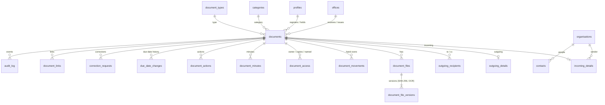

# NEC Document Tracking System: Database Schema

This document describes the complete Supabase (PostgreSQL) database for the NEC Document Tracking System. It explains how to import the schema into Supabase, how each part works, and which rules the database enforces. The full SQL is in the [appendix](#appendix-full-schema-sql).

| | |
|---|---|
| **Source of truth** | [`supabase/migrations/20261004000000_initial_schema.sql`](../supabase/migrations/20261004000000_initial_schema.sql). The appendix is a copy of this file. |
| **Based on** | *NEC Document Tracking System – Requirements Specification* (04/10/2026) |
| **Target** | Phase 1: online demo on Supabase cloud. Later: self-hosted Supabase on the office server (offline Mode A). |
| **Frontend** | Next.js, to be built later. Not part of this document. |

---

## Contents

1. [Overview](#1-overview)
2. [Importing the schema into Supabase](#2-importing-the-schema-into-supabase)
3. [After import: Supabase settings and first users](#3-after-import-supabase-settings-and-first-users)
4. [Roles and access (Row Level Security)](#4-roles-and-access-row-level-security)
5. [Tables](#5-tables)
6. [How the main features work](#6-how-the-main-features-work)
7. [Rules enforced by the database](#7-rules-enforced-by-the-database)
8. [Views](#8-views)
9. [Functions](#9-functions)
10. [System settings](#10-system-settings)
11. [Seed data](#11-seed-data)
12. [Decisions recorded](#12-decisions-recorded)
13. [Testing performed](#13-testing-performed)
14. [Known limits and next steps](#14-known-limits-and-next-steps)
15. [Appendix: full schema SQL](#appendix-full-schema-sql)

---

## 1. Overview

The database is built around four guarantees from the specification:

1. **Nothing is ever deleted.** No role has delete rights, and every table also has a trigger that rejects `DELETE` and `TRUNCATE`. Documents are voided with a reason instead. Configuration rows (categories, departments, …) are deactivated.
2. **Saved records are locked.** Once a document is registered, its register fields can only change through a **correction request** that an Administrator approves. The old and new values are both kept.
3. **Everything is audited.** Every insert and update is written to `audit_log`. The log is append-only, permanent and **hash-chained**: each entry's fingerprint includes the previous entry's, so tampering is detectable.
4. **People only see what they are entitled to.** Row Level Security filters every query by role and by document classification (Open / Restricted / Confidential).

```
             ┌──────────────────────────── Supabase ────────────────────────────┐
 Browser ──► │ Auth (logins, 2FA) ─► profiles (role, office, lock, password age)│
 (Next.js)   │                                                                  │
             │ PostgREST API ─► Row Level Security ─► tables ─► triggers        │
 Next.js ──► │                    (who sees what)      │       (locks, numbers, │
 API routes  │                                         │        audit, no-delete)│
             │ Storage bucket "document-files" ◄───────┘  (scans, versions)     │
             └──────────────────────────────────────────────────────────────────┘
```

---

## 2. Importing the schema into Supabase

The schema is a single SQL file. Import it **once, into a new (empty) Supabase project**. Running it a second time fails, because the types and tables already exist.

### Option A: Supabase Dashboard (simplest)

1. Create a project at [supabase.com](https://supabase.com). Note the region and the database password.
2. Open **SQL Editor → New query**.
3. Copy the whole of [`supabase/migrations/20261004000000_initial_schema.sql`](../supabase/migrations/20261004000000_initial_schema.sql), or the [appendix](#appendix-full-schema-sql), into the editor.
4. Click **Run**. It should finish with `Success. No rows returned`.
5. Run the [verification queries](#verify-the-import) below.

### Option B: Supabase CLI (repeatable, recommended once development starts)

```bash
# one-time
npm install -g supabase            # or: brew install supabase/tap/supabase
supabase login
cd NEC-Document-Tracking-System---South-Sudan-Government
supabase init                      # creates supabase/config.toml if it does not exist yet
supabase link --project-ref <your-project-ref>

# apply every file in supabase/migrations/ that has not been applied yet
supabase db push
```

Later schema changes are added as **new** files in `supabase/migrations/`, named with a timestamp. Applied files are never edited.

### What the import creates

| Item | Count / name |
|---|---|
| Enumerated types | 23 |
| Tables | 30 in `public` |
| Views | 4 |
| Functions | Helper, trigger and hook functions (see [section 9](#9-functions)) |
| Storage bucket | `document-files` (private, 100 MB per file, PDF/TIFF/JPEG/PNG) |
| Seed data | 2 offices, 4 priority rules, 7 categories, 9 document types, status transitions, system settings |
| Database timezone | `Africa/Juba` (CAT, UTC+2) |

### Verify the import

```sql
-- 30 tables
select count(*) from information_schema.tables
where table_schema = 'public' and table_type = 'BASE TABLE';

-- RLS is on for every table (expect no rows)
select tablename from pg_tables where schemaname = 'public' and not rowsecurity;

-- seed data
select code, name from public.offices;                 -- CH, SG
select priority, label, response_hours from public.priority_rules order by sort_order;

-- storage bucket
select id, public from storage.buckets where id = 'document-files';   -- public = false

-- timezone (open a new SQL editor tab first)
show timezone;                                          -- Africa/Juba
```

---

## 3. After import: Supabase settings and first users

### 3.1 Auth settings (Dashboard → Authentication)

| Setting | Value | Requirement |
|---|---|---|
| **Sign-ups** (Sign In / Providers) | Turn **off** "Allow new users to sign up" | Only Administrators create accounts |
| **Email provider** | Enabled | Personal accounts |
| **Minimum password length** | **10** | Password policy |
| **Multi-Factor (TOTP)** | Enabled | 2FA for remote logins |
| **Session inactivity timeout** (Sessions) | **15 minutes**, where your plan offers it. The Next.js app also enforces it. | Auto logout |
| **Auth Hooks → Password Verification Attempt** | Point it at `public.hook_password_verification_attempt`, where your plan offers it | Lock after 5 failed logins |

Some of these (session timeouts, auth hooks) depend on the Supabase plan. Check what your plan offers. The Next.js app will also enforce the 15-minute idle logout.

### 3.2 Creating the two System Administrators

Every user needs a row in `public.profiles` with a role. A user who exists in Supabase Auth but has **no profile can see nothing**.

**Step 1.** Go to **Dashboard → Authentication → Users → Add user → Create new user** for each administrator, with **Auto Confirm User** ticked.

**Step 2.** Run this in the SQL Editor (change the emails and names):

```sql
insert into public.profiles (id, full_name, email, role, office_id, job_title, must_change_password)
select u.id, 'Executive Director name', u.email, 'system_administrator',
       (select id from public.offices where code = 'CH'), 'Executive Director', false
from auth.users u where u.email = 'executive.director@example.org';

insert into public.profiles (id, full_name, email, role, office_id, job_title, must_change_password)
select u.id, 'Secretary name', u.email, 'system_administrator',
       (select id from public.offices where code = 'SG'), 'Secretary', false
from auth.users u where u.email = 'secretary@example.org';
```

The database rejects a third active System Administrator.

### 3.3 Creating all other users (from the app, later)

The Next.js server, using the **service role key**, which must never be sent to the browser, calls the Supabase Admin API. The role and office go in `app_metadata`, which users cannot change themselves. A database trigger then creates the profile automatically:

```ts
await supabaseAdmin.auth.admin.createUser({
  email: 'registry.officer@example.org',
  password: temporaryPassword,          // min 10 chars; must be changed at first login
  email_confirm: true,
  app_metadata: {
    role: 'registry_officer',            // system_administrator | registry_officer | action_officer | executive_viewer | auditor
    full_name: 'Registry Officer name',
    office_id: 1,                        // 1 = CH, 2 = SG (see public.offices)
    department_id: null,
    job_title: 'Registry Officer',
    created_by: '<administrator profile id>'
  }
});
```

New users start with `must_change_password = true`, and see no data until they change their password.

---

## 4. Roles and access (Row Level Security)

### 4.1 Database permissions by role

| Role | Who | SELECT (view) | INSERT | UPDATE | DELETE |
|---|---|---|---|---|---|
| **System Administrator** | Executive Director; Secretary | ✅ All documents, including Confidential; audit trail | ✅ | ❌ | ❌ |
| **Registry Officer** | Front-desk / registry staff | ✅ Open and Restricted, plus Confidential routed to them | ❌ | ❌ | ❌ |
| **Action Officer** | Staff assigned documents | ✅ Only documents routed, copied or named to them | ❌ | ❌ | ❌ |
| **Executive Viewer** | Chairperson; Secretary General; Deputy | ✅ All documents, including Confidential | ❌ | ❌ | ❌ |
| **Auditor** | Internal audit (read-only) | ✅ Open and Restricted; audit trail | ❌ | ❌ | ❌ |

- **No role can UPDATE or DELETE directly.** The one exception: a user can mark their *own* notifications as read.
- **Confidential** documents are visible only to Administrators, Executive Viewers and named recipients, as the specification requires. Auditors therefore do not see Confidential documents.
- **Open and Restricted** currently follow the same rules (decision recorded in [section 12](#12-decisions-recorded)).
- The tables Administrators may insert into are: `offices`, `departments`, `categories`, `document_types`, `organisations`, `contacts`, `documents`, `incoming_details`, `outgoing_details`, `outgoing_recipients`, `document_links`, `document_files`, `document_file_versions`, `document_access`, `document_movements`, `document_minutes`, `document_actions`, `correction_requests`, `notifications`, `backup_restore_tests`, `disposal_requests`.
- `audit_log`, `reference_counters` and `file_integrity_checks` are written only by the system.

### 4.2 How the work of other roles reaches the database

The specification gives Registry Officers and Action Officers workflow duties: registering, scanning, routing, recording actions and acknowledging receipt. At database level these roles have SELECT only. Their actions will be carried out by **Next.js API endpoints and database functions** (the next step). These check the user's role, perform the write, and record the user in the audit trail. The triggers in [section 7](#7-rules-enforced-by-the-database) apply to every write, whichever path it takes.

### 4.3 Session checks applied to every query

Before any row is returned, `is_session_permitted()` checks that the user:

- has a profile and is **active** (not suspended),
- is **not locked** (5 failed logins),
- has **changed their first-login password**,
- has a password **younger than 90 days**,
- if remote access (Mode B) is on and they are outside the office network: is **allowed remote access** and **logged in with 2FA** (`aal2`).

A user who fails any of these can still read **their own profile**, so the app can tell them why. They see no other data.

---

## 5. Tables

### 5.1 Configuration

| Table | Purpose | Key columns |
|---|---|---|
| `offices` | The two offices | `code` (CH, SG; used in reference numbers), `name` |
| `departments` | Departments | `office_id` (optional), `name`, `is_active` |
| `categories` | Document categories | `name`, `sort_order`, `is_active` |
| `document_types` | Purpose / document type | `name`, `sort_order`, `is_active` |
| `priority_rules` | Response time per priority | `priority`, `label`, `response_hours` |
| `status_transitions` | Allowed status changes | `direction`, `from_status`, `to_status` |
| `organisations` | Contacts list: organisations | `name` (unique, case-insensitive), `organisation_type`, `phone`, `email` |
| `contacts` | Contacts list: people | `organisation_id`, `full_name`, `title`, `phone`, `email` |
| `system_settings` | Key/value settings | `key`, `value` (JSON), `description` |

### 5.2 Users

| Table | Purpose | Key columns |
|---|---|---|
| `auth.users` | Supabase login (email, password, 2FA) | Managed by Supabase |
| `profiles` | NEC user record | `role`, `office_id`, `department_id`, `is_active`, `suspended_at/by/reason`, `must_change_password`, `password_changed_at`, `failed_login_attempts`, `locked_at`, `remote_access_allowed`, `last_login_at` |

### 5.3 Documents

**`documents`**: one row per registered document, incoming or outgoing.

| Column | Meaning |
|---|---|
| `direction` | `incoming` / `outgoing` |
| `office_id` | Receiving office (incoming) or issuing office (outgoing) |
| `reference_number`, `reference_year`, `reference_sequence` | e.g. `NEC/CH/IN/2026/00123`, set automatically |
| `registered_by`, `registered_at` | Logged-in user; server time |
| `received_at` | Incoming: date and time received (server time) |
| `entry_mode`, `manual_register_form_no` | `system`, or `manual_register_backfill` for paper forms used during an outage (keeps the original receipt time) |
| `subject`, `document_type_id`, `category_id` | Register fields |
| `priority` | `urgent` / `high` / `normal` / `low` |
| `classification` | `open` / `restricted` / `confidential` |
| `office_only` | Never shown outside the office network (Mode B) |
| `number_of_pages`, `number_of_attachments`, `physical_file_location` | Checked against the scan; where the original is filed |
| `status` | See [6.3](#63-statuses) |
| `current_holder_id`, `current_department_id`, `current_holder_since`, `current_physical_location` | Where the document is now and since when |
| `due_at` | Set from priority; changed only with a reason |
| `closing_note`, `closed_at`, `closed_by` | Required to close or file |
| `is_voided`, `void_reason`, `voided_by`, `voided_at` | Cancel / Void instead of delete |
| `search_vector` | Full-text index of reference and subject |

**`incoming_details`**: one per incoming document.

| Column | Meaning |
|---|---|
| `sender_organisation_id` / `sender_organisation_text` | From the contacts list, or free text |
| `sender_contact_id`, `sender_name`, `sender_title` | Sender |
| `delivered_by_name`, `delivered_by_phone`, `delivered_by_id_seen` | Person who brought it |
| `delivery_method` | Hand delivery, courier, post, email, fax |
| `sender_reference`, `sender_reference_date` | As printed on the letter |
| `response_required`, `response_due_date` | Response to the sender |
| `acknowledgement_method`, `acknowledgement_sent_to`, `acknowledgement_sent_at` | Acknowledgement slip (printed, SMS or email) |
| `label_printed_at` | Label or receipt stamp on the paper original |

**`outgoing_details`**: one per outgoing document.

| Column | Meaning |
|---|---|
| `drafted_by` | Person who created it |
| `signatory`, `signed_by_user_id`, `delegated_officer_name` | Chairperson, SG or delegated officer |
| `finalised_at`, `finalised_by` | Set when marked Final (the record then locks) |
| `dispatch_method`, `dispatched_at`, `dispatched_by_name`, `dispatch_recorded_by` | Dispatch (no fax) |
| `delivered_at`, `proof_of_delivery_note` | Delivery; the proof scan is a `proof_of_delivery` file |
| `feedback_required`, `feedback_due_date`, `feedback_officer_id` | Follow-up |
| `feedback_received_at`, `feedback_document_id` | The incoming reply that closes the follow-up |

**Other document tables**

| Table | Purpose |
|---|---|
| `outgoing_recipients` | Multiple *To* and *Cc* recipients (organisation, name, title) |
| `document_links` | `related`, `in_reply_to`, `feedback_for`, `internal_memo_pair` |
| `reference_counters` | The running number for each office, direction and year (internal) |

### 5.4 Files

| Table | Purpose | Key columns |
|---|---|---|
| `document_files` | A file on a document | `file_kind`: `main_scan`, `attachment`, `draft`, `signed_copy`, `proof_of_delivery`, `acknowledgement_slip` |
| `document_file_versions` | Every upload, never overwritten | `version_number`, `storage_path`, `sha256`, `size_bytes`, `mime_type`, `page_count`, `scan_dpi`, `is_colour`, `is_pdfa`, `ocr_text`, `reason`, `uploaded_by` |
| `file_integrity_checks` | Scheduled fingerprint checks | `computed_sha256`, `result` (`match` / `mismatch` / `missing`) |

### 5.5 Workflow

| Table | Purpose | Key columns |
|---|---|---|
| `document_access` | Primary owner, copies, named recipients | `user_id`, `access_type`, `granted_by`, `revoked_at`, `revoke_reason` |
| `document_movements` | Every hand-over | `movement_type`, `from_user_id`, `to_user_id`, `to_department_id`, `to_physical_location`, `reason`, `moved_at`, `acknowledged_at`, `acknowledged_by` |
| `document_minutes` | Chairperson / SG instructions | `author_id`, `directed_to_user_id`, `minute_text` |
| `document_actions` | Comments, actions, feedback | `action_type`, `action_text` |
| `due_date_changes` | Due-date history | `old_due_at`, `new_due_at`, `reason`, `changed_by` |

### 5.6 Integrity, notifications and operations

| Table | Purpose |
|---|---|
| `correction_requests` | Field, old value, new value, reason, requester, approver, decision, applied time |
| `audit_log` | Permanent, hash-chained record of every event |
| `notifications` | In-system alerts (email/SMS channels for later) |
| `backup_runs` | Log written by the backup script |
| `backup_restore_tests` | Quarterly restore tests |
| `disposal_requests` | Records disposal, which needs two different Administrators to approve |

### 5.7 Relationships



---

## 6. How the main features work

### 6.1 Reference numbers

- Format: `NEC/<office code>/<IN|OUT>/<year>/<5-digit sequence>`, for example `NEC/CH/IN/2026/00123` or `NEC/SG/OUT/2026/00045`.
- Generated by the insert trigger on `documents`, using `next_reference_number()`. You never supply one.
- Each office and direction has its own counter (`reference_counters`), which restarts at `00001` each calendar year in South Sudan time.
- The counter row is locked during the transaction. If the save fails, the number is not used up, so committed numbers have **no gaps and are never reused**. Voided documents keep their number.
- Outgoing numbers are issued at registration (status Draft), so they can be typed on the letter before signature.

### 6.2 Registering a document

A registration is **one transaction**, so that the specification's "the record cannot be saved without the scan" can be enforced:

**Incoming:** upload the scan to Storage, then in **one transaction**:

1. insert into `documents` (`direction = 'incoming'`)
2. insert into `incoming_details`
3. insert into `document_files` (`file_kind = 'main_scan'`)
4. insert into `document_file_versions` (with `sha256` and `ocr_text`)

At commit, the database checks that the details and the scan exist. If either is missing, nothing is saved.

**Outgoing:** in one transaction, insert into `documents` (`direction = 'outgoing'`) and `outgoing_details`. Recipients can be added in the same transaction.

The browser client (`supabase-js`) sends each insert as a separate transaction. Registration will therefore be a single API call: a Next.js endpoint or database function (next step) that does all the inserts together.

The insert trigger also sets:

- `registered_at` and `received_at` to server time,
- `registered_by` to the logged-in user,
- `status` to `registered` (incoming) or `draft` (outgoing),
- `due_at` to received time plus the priority's response time,
- the current holder to the registering user.

### 6.3 Statuses

Allowed changes are listed in `status_transitions`. Any other change is rejected.

**Incoming**

```
registered ──► routed ──► with_action_officer ──► action_taken ──► closed
     │            │  ▲           │   ▲   │             │
     │            │  │           │   │   └─────────────┼──► closed (noted)
     │            ▼  │           ▼   │                 └──► with_action_officer (rework)
     │      returned_for_clarification / on_hold
     └──────────────► filed  (also from routed / with_action_officer)
```

**Outgoing**

```
draft ──► final (locked) ──► dispatched ──► delivered ──► awaiting_feedback ──► closed
                                                 └────────────────────────────► closed (no feedback needed)
```

Extra checks when the status changes:

- **closed / filed:** a closing note, `closed_at` and `closed_by` are required.
- **outgoing → final:** `finalised_at` and `finalised_by` are recorded, and the record locks.
- **outgoing → delivered:** needs the delivery date plus a proof-of-delivery note or file.
- **outgoing → closed:** needs the signed scanned copy.

### 6.4 Routing, hand-overs and acknowledgement

- Every hand-over is a row in `document_movements`: from whom, to whom, date and time, and reason. It covers system routing, forwarding, returning, reassigning and physical file movement.
- Movements cannot be edited or removed. Only `acknowledged_at` / `acknowledged_by` can be filled in, once.
- Hand-overs not acknowledged after 24 hours appear in `v_unacknowledged_movements`.
- `document_access` records the primary owner (only one at a time), copies and named recipients. It also controls who outside the all-seeing roles can see a document.
- Minutes from the Chairperson / SG go in `document_minutes`. Comments, actions and feedback go in `document_actions`.

### 6.5 Due dates

- Set automatically from `priority_rules`: Urgent 24 h, High 72 h, Normal 168 h, Low 336 h.
- To change one, a row goes in `due_date_changes` with a reason. The `documents.due_at` change is accepted only inside that operation. A direct change is rejected.

### 6.6 Locking and corrections

- After registration, the register fields of `documents`, `incoming_details`, `outgoing_details` and `outgoing_recipients` are locked. Only workflow fields can change: status, holder, closing, acknowledgement, dispatch, delivery and feedback.
- An outgoing document stays editable while it is a **Draft**. It locks when marked **Final**.
- To change a locked field:
  1. A user creates a `correction_requests` row (field, old value, new value, reason).
  2. An Administrator other than the requester approves or rejects it.
  3. The approved change is applied inside the correction operation. The audit entry stores the old value, the new value and the correction request ID.
- Reference numbers, office, direction, registered-by and registered-at **cannot change at all**, not even by correction.
- A **voided** document cannot change any further.

### 6.7 Files and fingerprints

- Bucket `document-files` is **private**. Path convention: `{document_id}/{file_id}/v{version}.pdf`.
- Files can be read by anyone who can see the document. Direct uploads are allowed for Administrators; Registry Officers upload through the Next.js API endpoint.
- Storage has **no update or delete policy**, so a stored file can never be replaced or removed. A re-scan is uploaded as a new version, with a reason, and the original stays in the history.
- Each version stores its **SHA-256** fingerprint. A scheduled job (next step) re-hashes the stored files and writes the results to `file_integrity_checks`. Any `mismatch` or `missing` result alerts the Administrators.
- OCR text goes in `document_file_versions.ocr_text`, which is automatically indexed for full-text search (`ocr_tsv`).

### 6.8 Audit trail

- A trigger on every records table writes an entry for each insert and update: the actor, the time, the IP address and browser (from the API request), the document, and for updates **only the changed fields with their old and new values**.
- The browser reports views, downloads, prints, report exports, logins and logouts through `log_client_event()`, which accepts only those event types.
- Failed logins and account locks are written by the password hook.
- **Hash chain:** `row_hash = sha256(prev_hash | id | time | actor | event | document | details)`. This query checks the chain:

```sql
select bool_and(ok) as chain_intact from (
  select row_hash = encode(sha256(convert_to(concat_ws('|',
           coalesce(prev_hash, 'GENESIS'), id, extract(epoch from occurred_at),
           actor_id, event_type, document_id, details::text), 'UTF8')), 'hex')
     and prev_hash is not distinct from lag(row_hash) over (order by id) as ok
  from public.audit_log) a;
```

### 6.9 Search

- `documents.search_vector`: full-text index of reference number and subject.
- `document_file_versions.ocr_tsv`: full-text index of words inside scans.
- Trigram indexes on subject and sender names, for misspellings and partial matches.
- Every search goes through Row Level Security, so users never find Confidential documents they are not entitled to.

```sql
-- words inside scanned letters
select distinct d.reference_number, d.subject
from public.document_file_versions v
join public.documents d on d.id = v.document_id
where v.ocr_tsv @@ websearch_to_tsquery('english', 'voter registration');
```

### 6.10 Accounts

- **Two administrators at most:** the trigger `limit_administrators` rejects a third active System Administrator.
- **Lockout:** after 5 failed passwords, `locked_at` is set and further logins are rejected until an Administrator unlocks the account.
- **Suspension:** `is_active = false`, with `suspended_at`, `suspended_by` and `suspension_reason`. The user's history is untouched.
- **Password age:** measured from `password_changed_at` (90 days by default).

---

## 7. Rules enforced by the database

| Rule | Mechanism |
|---|---|
| No deletes, by anyone | `prevent_delete` and `prevent_truncate` triggers on all 30 tables, and no DELETE grant |
| Permanent tables cannot be edited | `prevent_update` on `audit_log`, `document_file_versions`, `file_integrity_checks`, `document_minutes`, `document_actions`, `due_date_changes`, `document_links`, `document_files`, `backup_restore_tests` |
| Only certain columns can change | `tg_allow_only` on `document_access` (revoke only), `notifications` (read/sent), `backup_runs`, `disposal_requests`; `movements_lock`; `corrections_lock` |
| Register fields lock on save | `documents_before_update`, `tg_details_lock` |
| Incoming cannot be saved without a scan | `documents_check_complete` (checked at commit) |
| Server time, automatic reference numbers, due dates | `documents_before_insert` |
| Valid status changes only | `status_transitions` and `documents_before_update` |
| At most two administrators | `limit_administrators` |
| Everything audited | `audit_row` triggers and `audit_chain` |
| Required fields and consistency | Check constraints: closing note, void reason, response due date when a response is required, feedback officer and due date when feedback is required, delegated officer named, sender organisation given, no fax for outgoing, and others |

---

## 8. Views

All views use `security_invoker`, so they respect the viewer's Row Level Security.

| View | Use |
|---|---|
| `v_document_tracker` | Every document: current holder, how long held, due date, `is_overdue`, `days_overdue`. Drives the dashboard and the "where is it" screen. |
| `v_unacknowledged_movements` | Hand-overs not acknowledged within 24 hours |
| `v_feedback_overdue` | Outgoing documents whose feedback is past its due date |
| `v_current_file_versions` | The latest version of each file |

---

## 9. Functions

| Function | Purpose |
|---|---|
| `my_role()`, `has_role(...)` | The current user's role |
| `is_session_permitted()` | Active, unlocked, password current, 2FA when remote |
| `can_view_document(id)` | Classification and access rules |
| `is_office_network()`, `request_ip()` | Office-network check for Mode B |
| `setting(key)` | Read a system setting |
| `next_reference_number(...)` | Reference number generator |
| `log_client_event(event, document, details)` | Client-reported audit events (view, download, print, export, login, logout) |
| `write_audit(...)` | Internal audit writer |
| `hook_password_verification_attempt(event)` | Supabase Auth hook: counts failed logins and locks the account |
| `changed_columns(...)`, `in_correction_context()` | Internal helpers for the lock triggers |
| `tg_*` | Trigger functions |

---

## 10. System settings

| Key | Default | Meaning |
|---|---|---|
| `remote_access_enabled` | `false` | Mode B. While `false`, every connection counts as "office". |
| `office_networks` | `["192.168.0.0/16", "10.0.0.0/8"]` | Office LAN ranges, used when Mode B is on |
| `email_alerts_enabled` | `false` | Email alerts |
| `sms_alerts_enabled` | `false` | SMS alerts |
| `password_min_length` | `10` | Also set in Supabase Auth |
| `password_max_age_days` | `90` | Password expiry |
| `max_failed_logins` | `5` | Lockout threshold |
| `session_idle_minutes` | `15` | Idle logout (enforced by Supabase Auth and the app) |
| `acknowledge_within_hours` | `24` | Unacknowledged hand-over flag |
| `confidential_office_only_default` | `true` | New Confidential documents default to office-only |

For the online demo, keep `remote_access_enabled = false`. Every logged-in user is then treated as being on the office network, and 2FA is not forced.

---

## 11. Seed data

| Table | Rows |
|---|---|
| `offices` | CH, Office of the Chairperson; SG, Office of the Secretary General |
| `priority_rules` | Urgent 24 h · High 72 h · Normal 168 h · Low 336 h |
| `categories` | Operations, Finance, Legal, Partners/Donors, Political parties, Government, HR |
| `document_types` | Letter, Request, Invitation, Report, Complaint, Legal notice, Invoice, Memo, Other |
| `status_transitions` | As in [6.3](#63-statuses) |
| `system_settings` | As in [section 10](#10-system-settings) |

NEC still has to confirm the final categories, departments and priority times. Administrators can add categories and departments. Existing rows are deactivated, not deleted.

---

## 12. Decisions recorded

| Topic | Decision |
|---|---|
| Database permissions | Administrators: SELECT + INSERT. Registry Officer, Action Officer, Executive Viewer, Auditor: SELECT. **No role can delete.** Auditors cannot edit anything. |
| Restricted vs Open | Left as is. Both follow the same visibility rules. |
| Internal memos | Kept as ordinary records: an outgoing record in the sending office and an incoming record in the receiving office, linked as `internal_memo_pair`. |
| Locked accounts | Stay locked until an Administrator unlocks them. |
| Roles | One role per user. |
| File uploads | Through the UI, using a Next.js API endpoint connected to Supabase. |
| Offline working | Deferred. Phase 1 is an **online demo** on Supabase cloud. The offline architecture will be designed afterwards. |
| Frontend | Next.js, built later. |

---

## 13. Testing performed

I applied the schema to a local PostgreSQL 16 database, using stand-ins for Supabase's `auth` and `storage` schemas. All of these checks passed:

- Reference numbers came out as `NEC/CH/IN/2026/00001`, `…00002`, `NEC/SG/IN/2026/00001` and `NEC/CH/OUT/2026/00001`. A failed save did not use up a number.
- An incoming record without a scan was rejected. A document without its details row was rejected at commit.
- A High priority document got a due date of received time + 3 days.
- Editing a saved subject, sender, reference number or due date was blocked. An approved correction went through, and the audit entry shows the old and new values and the request ID. A decided correction could not be decided again.
- Delete and truncate were blocked on documents and the audit log. Editing an audit entry or a file version was blocked.
- Invalid status jumps were blocked. Changing a voided document was blocked.
- An outgoing draft could be edited and locked once Final. Delivered without proof was blocked. Closing without the signed copy was blocked.
- Access, tested as the actual browser role:
  - An Administrator could insert an organisation, a category, and an outgoing document with its details (with the registering user forced to the Administrator, and the audit actor correct).
  - A Registry Officer and an Auditor could not insert.
  - An Administrator could not update or delete.
  - Each role saw exactly the documents in [4.1](#41-database-permissions-by-role). An Action Officer saw no audit rows.
  - Storage: an Administrator could upload; a Registry Officer could not upload directly.
- Full-text search found a phrase inside OCR text and respected classification.
- A third administrator was rejected. A Dashboard-created user without a role got no profile and no access.
- 5 failed passwords locked the account, and the lock then rejected a correct password.
- The audit hash chain verified intact.

---

## 14. Known limits and next steps

1. **Workflow functions and API endpoints (next step):**
   - registering incoming and outgoing documents as a single call,
   - routing, forwarding, returning and acknowledging,
   - minutes and actions, due-date changes, closing and voiding,
   - correction requests and approvals,
   - Final, dispatch, delivery and feedback,
   - user management (create, suspend, reset, unlock),
   - file upload and the OCR pipeline.
2. **Scheduled jobs:** due-in-24-hours and overdue alerts, the daily overdue summary, fingerprint checks (for example with `pg_cron` or Supabase Edge Functions).
3. **Plan-dependent Supabase features:** the session inactivity timeout and auth hooks depend on the Supabase plan. The app will also enforce the idle logout.
4. **Offline Mode A:** the same migration runs on self-hosted Supabase. The deployment design comes after the demo.
5. **Who keeps unrestricted database access:** the `postgres` superuser and the service role key bypass Row Level Security. The no-delete and lock triggers still apply to them, but a superuser could disable triggers. After handover these credentials must be held only by the two Administrators.

---

## Appendix: full schema SQL

This is the complete content of `supabase/migrations/20261004000000_initial_schema.sql`. Paste it into the Supabase SQL Editor and run it once on a new project.

```sql
-- =============================================================================
-- NEC Document Tracking System — initial database schema (Supabase / PostgreSQL)
-- =============================================================================
-- Source: NEC Document Tracking System – Requirements Specification (04/10/2026)
--
-- Design principles
--   * Nothing is ever deleted. DELETE and TRUNCATE are blocked by triggers on every
--     records table; "delete" is replaced by Void (documents.is_voided).
--   * Registered records lock on save. Locked fields change only through an
--     approved correction request (correction_requests), which keeps old + new values.
--   * Every change is written to an append-only, hash-chained audit_log.
--   * Row Level Security: every role may SELECT (filtered by classification);
--     only System Administrators may INSERT; no role may UPDATE or DELETE
--     directly. Workflow writes for other roles go through the API layer /
--     SECURITY DEFINER functions (next step). Triggers enforce the rules
--     whichever path a write takes.
--   * Scanned files live in a private Storage bucket; every version is kept and
--     carries a SHA-256 fingerprint.
--   * Phase 1 is an online demo on Supabase cloud. The same schema runs on
--     self-hosted Supabase for the offline office setup (Mode A) later.
-- =============================================================================

-- -----------------------------------------------------------------------------
-- 0. Extensions and database settings
-- -----------------------------------------------------------------------------
create extension if not exists pg_trgm with schema extensions;   -- fuzzy search on names/subjects

-- South Sudan local time (CAT, UTC+2). Timestamps are stored as timestamptz;
-- this only changes how they are displayed and how "today" is calculated.
alter database postgres set timezone to 'Africa/Juba';

-- -----------------------------------------------------------------------------
-- 1. Enumerated types
-- -----------------------------------------------------------------------------
create type public.user_role as enum (
  'system_administrator',   -- Executive Director; Secretary (max 2, enforced)
  'registry_officer',       -- front desk / registry staff
  'action_officer',         -- staff assigned documents
  'executive_viewer',       -- Chairperson; Secretary General; Deputy
  'auditor'                 -- internal audit, read-only
);

create type public.document_direction as enum ('incoming', 'outgoing');

create type public.document_status as enum (
  -- incoming
  'registered', 'routed', 'with_action_officer', 'action_taken',   -- action_taken = "Action taken / Reply drafted"
  'returned_for_clarification', 'on_hold', 'filed',
  -- outgoing
  'draft', 'final', 'dispatched', 'delivered', 'awaiting_feedback',
  -- both
  'closed'
);

create type public.priority_level       as enum ('urgent', 'high', 'normal', 'low');
create type public.classification_level as enum ('open', 'restricted', 'confidential');
create type public.delivery_method      as enum ('hand_delivery', 'courier', 'post', 'email', 'fax');
create type public.signatory_type       as enum ('chairperson', 'secretary_general', 'delegated_officer');
create type public.recipient_type       as enum ('to', 'cc');
create type public.entry_mode           as enum ('system', 'manual_register_backfill');
create type public.ack_method           as enum ('printed', 'sms', 'email');

create type public.document_link_type as enum (
  'related',              -- earlier letters in the same matter
  'in_reply_to',          -- outgoing -> the incoming item it answers
  'feedback_for',         -- incoming reply -> the outgoing item awaiting feedback
  'internal_memo_pair'    -- outgoing memo (one office) <-> incoming memo (other office)
);

create type public.file_kind as enum (
  'main_scan',            -- incoming: the scanned document (required)
  'attachment',           -- extra files sent with the document
  'draft',                -- outgoing: draft versions
  'signed_copy',          -- outgoing: final signed scan (required to close)
  'proof_of_delivery',    -- outgoing: delivery book page, courier receipt, email confirmation
  'acknowledgement_slip'  -- incoming: slip given to the person who delivered it
);

create type public.access_type   as enum ('primary_owner', 'copy', 'named_recipient');
create type public.movement_type as enum ('routed', 'forwarded', 'returned', 'reassigned', 'physical_transfer');
create type public.action_type   as enum ('comment', 'action_taken', 'feedback', 'task_completed', 'clarification_requested');
create type public.correction_status as enum ('pending', 'approved', 'rejected');
create type public.integrity_result  as enum ('match', 'mismatch', 'missing');
create type public.backup_type       as enum ('daily', 'weekly', 'monthly');
create type public.test_result       as enum ('pass', 'fail');
create type public.disposal_status   as enum ('pending', 'approved', 'rejected');

create type public.notification_type as enum (
  'new_assignment', 'due_in_24_hours', 'overdue', 'feedback_overdue',
  'unacknowledged', 'daily_overdue_summary', 'correction_request',
  'correction_decision', 'integrity_alert'
);
create type public.notification_channel as enum ('in_app', 'email', 'sms');

create type public.audit_event_type as enum (
  -- sessions
  'login', 'logout', 'login_failed', 'account_locked',
  -- document access
  'document_viewed', 'document_downloaded', 'document_printed',
  -- document lifecycle
  'document_created', 'document_updated', 'document_status_changed',
  'document_routed', 'document_forwarded', 'document_returned', 'document_reassigned',
  'physical_file_moved', 'document_acknowledged', 'document_closed', 'document_voided',
  'document_linked', 'access_granted', 'access_revoked',
  'minute_added', 'action_recorded', 'due_date_changed', 'file_version_added',
  -- corrections
  'correction_requested', 'correction_approved', 'correction_rejected',
  -- administration
  'user_created', 'user_updated', 'user_role_changed', 'user_suspended',
  'user_reactivated', 'user_unlocked', 'password_reset', 'settings_changed',
  'lookup_changed',
  -- reporting / operations
  'report_exported', 'integrity_check_failed', 'backup_restore_tested',
  'disposal_requested', 'disposal_decided'
);

-- -----------------------------------------------------------------------------
-- 2. Configuration and lookup tables
--    Administrators configure these. Rows are deactivated, never deleted.
-- -----------------------------------------------------------------------------
create table public.offices (
  id          smallint generated always as identity primary key,
  code        text not null unique check (code ~ '^[A-Z]{2,4}$'),  -- CH, SG; used in reference numbers
  name        text not null unique,
  is_active   boolean not null default true,
  created_at  timestamptz not null default now(),
  updated_at  timestamptz not null default now()
);

create table public.departments (
  id          integer generated always as identity primary key,
  office_id   smallint references public.offices(id),            -- null = commission-wide
  name        text not null,
  is_active   boolean not null default true,
  created_at  timestamptz not null default now(),
  updated_at  timestamptz not null default now(),
  unique (office_id, name)
);

create table public.categories (                -- Operations, Finance, Legal, ...
  id          integer generated always as identity primary key,
  name        text not null unique,
  sort_order  integer not null default 0,
  is_active   boolean not null default true,
  created_at  timestamptz not null default now(),
  updated_at  timestamptz not null default now()
);

create table public.document_types (            -- Letter, request, invitation, ...
  id          integer generated always as identity primary key,
  name        text not null unique,
  sort_order  integer not null default 0,
  is_active   boolean not null default true,
  created_at  timestamptz not null default now(),
  updated_at  timestamptz not null default now()
);

-- Response time per priority. Kept in a table because NEC still has to confirm
-- the values (24 hrs / 3 / 7 / 14 days proposed).
create table public.priority_rules (
  priority        public.priority_level primary key,
  label           text not null,
  response_hours  integer not null check (response_hours > 0),
  sort_order      integer not null,
  updated_at      timestamptz not null default now()
);

-- Allowed status changes. The trigger on documents rejects anything not listed.
create table public.status_transitions (
  direction    public.document_direction not null,
  from_status  public.document_status not null,
  to_status    public.document_status not null,
  primary key (direction, from_status, to_status)
);

-- Contacts list, so sender/recipient names are spelled consistently.
create table public.organisations (
  id                 uuid primary key default gen_random_uuid(),
  name               text not null,
  organisation_type  text,                       -- e.g. Government, Political party, Donor
  address            text,
  phone              text,
  email              text,
  is_active          boolean not null default true,
  created_by         uuid,
  created_at         timestamptz not null default now(),
  updated_at         timestamptz not null default now()
);
create unique index organisations_name_unique on public.organisations (lower(name));

create table public.contacts (
  id               uuid primary key default gen_random_uuid(),
  organisation_id  uuid references public.organisations(id),
  full_name        text not null,
  title            text,
  phone            text,
  email            text,
  is_active        boolean not null default true,
  created_by       uuid,
  created_at       timestamptz not null default now(),
  updated_at       timestamptz not null default now()
);
create index contacts_organisation_idx on public.contacts (organisation_id);

-- Key/value system settings (Mode B switch, password policy, office networks, ...).
create table public.system_settings (
  key          text primary key,
  value        jsonb not null,
  description  text,
  updated_by   uuid,
  updated_at   timestamptz not null default now()
);

-- -----------------------------------------------------------------------------
-- 3. Users
--    Login credentials live in Supabase Auth (auth.users). This table holds the
--    NEC-specific profile, role and account-control fields.
-- -----------------------------------------------------------------------------
create table public.profiles (
  id                     uuid primary key references auth.users(id),
  full_name              text not null,
  job_title              text,
  email                  text,
  phone                  text,
  role                   public.user_role not null,
  office_id              smallint references public.offices(id),
  department_id          integer references public.departments(id),

  -- account status
  is_active              boolean not null default true,
  suspended_at           timestamptz,
  suspended_by           uuid references public.profiles(id),
  suspension_reason      text,

  -- password policy (min 10 chars is set in Supabase Auth config)
  must_change_password   boolean not null default true,        -- forced change at first login
  password_changed_at    timestamptz not null default now(),   -- 90-day expiry measured from here
  failed_login_attempts  integer not null default 0,
  locked_at              timestamptz,                          -- set after 5 failed attempts; admin unlocks

  -- remote access (Mode B)
  remote_access_allowed  boolean not null default false,

  last_login_at          timestamptz,
  created_by             uuid references public.profiles(id),
  created_at             timestamptz not null default now(),
  updated_at             timestamptz not null default now(),

  constraint suspended_fields_consistent
    check (is_active or (suspended_at is not null and suspended_by is not null))
);
create index profiles_role_idx on public.profiles (role) where is_active;

alter table public.organisations   add foreign key (created_by) references public.profiles(id);
alter table public.contacts        add foreign key (created_by) references public.profiles(id);
alter table public.system_settings add foreign key (updated_by) references public.profiles(id);

-- -----------------------------------------------------------------------------
-- 4. Documents
--    One row per registered document (incoming or outgoing). Fields specific to
--    each direction live in incoming_details / outgoing_details (1:1).
-- -----------------------------------------------------------------------------
create table public.reference_counters (       -- per office / direction / year; restarts each year
  office_id   smallint not null references public.offices(id),
  direction   public.document_direction not null,
  year        integer not null,
  last_value  integer not null,
  primary key (office_id, direction, year)
);

create table public.documents (
  id                        uuid primary key default gen_random_uuid(),
  direction                 public.document_direction not null,
  office_id                 smallint not null references public.offices(id),  -- receiving / issuing office

  -- reference number, e.g. NEC/CH/IN/2026/00123 (set by trigger, never edited or reused)
  reference_number          text not null unique,
  reference_year            integer not null,
  reference_sequence        integer not null,

  -- registration (server time, logged-in user)
  registered_by             uuid not null references public.profiles(id),
  registered_at             timestamptz not null default now(),
  received_at               timestamptz,            -- incoming: date/time received
  entry_mode                public.entry_mode not null default 'system',
  manual_register_form_no   text,                   -- outage form number when back-filled

  -- common register fields
  subject                   text not null check (length(trim(subject)) > 0),
  document_type_id          integer not null references public.document_types(id),
  category_id               integer not null references public.categories(id),
  priority                  public.priority_level not null,
  classification            public.classification_level not null,
  office_only               boolean not null default false,   -- Mode B: never shown off the office network
  number_of_pages           integer check (number_of_pages > 0),
  number_of_attachments     integer not null default 0 check (number_of_attachments >= 0),
  physical_file_location    text,                   -- where the original was filed (cabinet, shelf, file no.)

  -- tracking (changed only by workflow functions)
  status                    public.document_status not null,
  current_holder_id         uuid references public.profiles(id),
  current_department_id     integer references public.departments(id),
  current_holder_since      timestamptz,
  current_physical_location text,
  due_at                    timestamptz,            -- from priority; changed only via due_date_changes
  closing_note              text,                   -- e.g. "replied by OUT/2026/00045"
  closed_at                 timestamptz,
  closed_by                 uuid references public.profiles(id),

  -- void instead of delete
  is_voided                 boolean not null default false,
  void_reason               text,
  voided_by                 uuid references public.profiles(id),
  voided_at                 timestamptz,

  created_at                timestamptz not null default now(),
  updated_at                timestamptz not null default now(),

  -- full-text search over reference + subject (OCR text is indexed on file versions)
  search_vector tsvector generated always as (
    to_tsvector('english', coalesce(reference_number, '') || ' ' || coalesce(subject, ''))
  ) stored,

  unique (office_id, direction, reference_year, reference_sequence),

  constraint status_matches_direction check (
    (direction = 'incoming' and status in ('registered','routed','with_action_officer','action_taken',
                                           'returned_for_clarification','on_hold','filed','closed'))
    or
    (direction = 'outgoing' and status in ('draft','final','dispatched','delivered','awaiting_feedback','closed'))
  ),
  constraint incoming_required_fields check (
    direction <> 'incoming'
    or (received_at is not null and number_of_pages is not null and physical_file_location is not null)
  ),
  constraint closing_requires_note check (
    status not in ('closed', 'filed')
    or (closing_note is not null and length(trim(closing_note)) > 0 and closed_at is not null and closed_by is not null)
  ),
  constraint void_requires_reason check (
    not is_voided or (void_reason is not null and voided_by is not null and voided_at is not null)
  ),
  constraint backfill_requires_form_no check (
    entry_mode = 'system' or manual_register_form_no is not null
  )
);
create index documents_status_idx       on public.documents (status) where not is_voided;
create index documents_holder_idx       on public.documents (current_holder_id) where not is_voided;
create index documents_due_idx          on public.documents (due_at) where not is_voided and status not in ('closed','filed');
create index documents_office_dir_idx   on public.documents (office_id, direction, registered_at desc);
create index documents_received_idx     on public.documents (received_at desc);
create index documents_category_idx     on public.documents (category_id);
create index documents_search_idx       on public.documents using gin (search_vector);
create index documents_subject_trgm_idx on public.documents using gin (subject extensions.gin_trgm_ops);

create table public.incoming_details (
  document_id               uuid primary key references public.documents(id),

  -- sender (pick from contacts list, or free text when not yet listed)
  sender_organisation_id    uuid references public.organisations(id),
  sender_organisation_text  text,
  sender_contact_id         uuid references public.contacts(id),
  sender_name               text not null,
  sender_title              text not null,

  -- person who physically brought it
  delivered_by_name         text not null,
  delivered_by_phone        text,
  delivered_by_id_seen      boolean not null,
  delivery_method           public.delivery_method not null,

  -- as printed on the letter
  sender_reference          text,
  sender_reference_date     date,

  -- response to the sender
  response_required         boolean not null,
  response_due_date         date,

  -- receipt formalities (filled after save; not locked)
  acknowledgement_method    public.ack_method,
  acknowledgement_sent_to   text,                 -- phone number / email used
  acknowledgement_sent_at   timestamptz,
  label_printed_at          timestamptz,           -- reference/receipt label on the paper original

  constraint sender_organisation_given check (
    sender_organisation_id is not null or nullif(trim(sender_organisation_text), '') is not null
  ),
  constraint response_due_date_when_required check (
    not response_required or response_due_date is not null
  )
);
create index incoming_sender_org_idx on public.incoming_details (sender_organisation_id);
create index incoming_sender_trgm_idx on public.incoming_details
  using gin ((coalesce(sender_organisation_text, '') || ' ' || sender_name) extensions.gin_trgm_ops);

create table public.outgoing_details (
  document_id                uuid primary key references public.documents(id),

  drafted_by                 uuid not null references public.profiles(id),
  signatory                  public.signatory_type not null,
  signed_by_user_id          uuid references public.profiles(id),
  delegated_officer_name     text,
  finalised_at               timestamptz,          -- marked Final -> record locked
  finalised_by               uuid references public.profiles(id),

  -- dispatch
  dispatch_method            public.delivery_method,
  dispatched_at              timestamptz,
  dispatched_by_name         text,                 -- messenger / courier
  dispatch_recorded_by       uuid references public.profiles(id),

  -- delivery
  delivered_at               timestamptz,          -- date received by recipient
  proof_of_delivery_note     text,                 -- e.g. courier tracking no.; scan goes in document_files

  -- feedback follow-up
  feedback_required          boolean not null,
  feedback_due_date          date,
  feedback_officer_id        uuid references public.profiles(id),
  feedback_received_at       timestamptz,
  feedback_document_id       uuid references public.documents(id),   -- the incoming reply

  constraint delegated_officer_named check (
    signatory <> 'delegated_officer' or signed_by_user_id is not null or delegated_officer_name is not null
  ),
  constraint no_fax_for_outgoing check (dispatch_method is distinct from 'fax'),
  constraint dispatch_fields_together check (
    dispatched_at is null or (dispatch_method is not null and dispatched_by_name is not null)
  ),
  constraint feedback_fields_when_required check (
    not feedback_required or (feedback_due_date is not null and feedback_officer_id is not null)
  )
);
create index outgoing_feedback_due_idx on public.outgoing_details (feedback_due_date)
  where feedback_required and feedback_received_at is null;

create table public.outgoing_recipients (
  id                 uuid primary key default gen_random_uuid(),
  document_id        uuid not null references public.documents(id),
  recipient_type     public.recipient_type not null,
  organisation_id    uuid references public.organisations(id),
  organisation_text  text,
  contact_id         uuid references public.contacts(id),
  recipient_name     text,
  recipient_title    text,
  sort_order         integer not null default 0,
  created_at         timestamptz not null default now(),
  constraint recipient_identified check (
    organisation_id is not null or nullif(trim(organisation_text), '') is not null
  )
);
create index outgoing_recipients_doc_idx on public.outgoing_recipients (document_id);
create index outgoing_recipients_org_idx on public.outgoing_recipients (organisation_id);

create table public.document_links (
  id                uuid primary key default gen_random_uuid(),
  from_document_id  uuid not null references public.documents(id),
  to_document_id    uuid not null references public.documents(id),
  link_type         public.document_link_type not null,
  note              text,
  created_by        uuid not null references public.profiles(id),
  created_at        timestamptz not null default now(),
  unique (from_document_id, to_document_id, link_type),
  check (from_document_id <> to_document_id)
);
create index document_links_to_idx on public.document_links (to_document_id);

-- -----------------------------------------------------------------------------
-- 5. Files and versions (scans live in Storage bucket "document-files")
-- -----------------------------------------------------------------------------
create table public.document_files (
  id           uuid primary key default gen_random_uuid(),
  document_id  uuid not null references public.documents(id),
  file_kind    public.file_kind not null,
  title        text,
  created_by   uuid not null references public.profiles(id),
  created_at   timestamptz not null default now()
);
create index document_files_doc_idx on public.document_files (document_id);
-- one main scan / one signed copy per document; corrections are new versions of it
create unique index document_files_one_main_scan on public.document_files (document_id)
  where file_kind = 'main_scan';
create unique index document_files_one_signed_copy on public.document_files (document_id)
  where file_kind = 'signed_copy';

create table public.document_file_versions (
  id               uuid primary key default gen_random_uuid(),
  file_id          uuid not null references public.document_files(id),
  document_id      uuid not null references public.documents(id),   -- denormalised for RLS / audit
  version_number   integer not null check (version_number > 0),
  storage_bucket   text not null default 'document-files',
  storage_path     text not null unique,        -- {document_id}/{file_id}/v{n}.pdf
  original_filename text,
  mime_type        text not null,
  size_bytes       bigint not null check (size_bytes > 0),
  sha256           text not null check (sha256 ~ '^[0-9a-f]{64}$'),  -- fingerprint at upload
  page_count       integer,
  scan_dpi         integer,
  is_colour        boolean,
  is_pdfa          boolean not null default false,
  ocr_text         text,                         -- extracted text, for full-text search
  ocr_tsv          tsvector generated always as (to_tsvector('english', coalesce(ocr_text, ''))) stored,
  reason           text,                         -- required from version 2 (why re-scanned)
  uploaded_by      uuid not null references public.profiles(id),
  uploaded_at      timestamptz not null default now(),
  unique (file_id, version_number),
  constraint reason_for_new_version check (version_number = 1 or nullif(trim(reason), '') is not null)
);
create index file_versions_doc_idx on public.document_file_versions (document_id);
create index file_versions_ocr_idx on public.document_file_versions using gin (ocr_tsv);

-- Scheduled fingerprint checks (run by a server job that re-hashes stored files)
create table public.file_integrity_checks (
  id                bigint generated always as identity primary key,
  file_version_id   uuid not null references public.document_file_versions(id),
  checked_at        timestamptz not null default now(),
  computed_sha256   text,
  result            public.integrity_result not null,
  admins_alerted_at timestamptz
);
create index integrity_checks_version_idx on public.file_integrity_checks (file_version_id, checked_at desc);
create index integrity_checks_problems_idx on public.file_integrity_checks (checked_at desc) where result <> 'match';

-- -----------------------------------------------------------------------------
-- 6. Routing, movement and actions
-- -----------------------------------------------------------------------------
-- Who may see a document beyond their role: primary owner, copies, and named
-- recipients of Confidential items. Revoked, never deleted.
create table public.document_access (
  id           uuid primary key default gen_random_uuid(),
  document_id  uuid not null references public.documents(id),
  user_id      uuid not null references public.profiles(id),
  access_type  public.access_type not null,
  granted_by   uuid not null references public.profiles(id),
  granted_at   timestamptz not null default now(),
  revoked_by   uuid references public.profiles(id),
  revoked_at   timestamptz,
  revoke_reason text,
  check (revoked_at is null or (revoked_by is not null and revoke_reason is not null))
);
create index document_access_user_idx on public.document_access (user_id) where revoked_at is null;
create index document_access_doc_idx  on public.document_access (document_id);
create unique index document_access_one_primary on public.document_access (document_id)
  where access_type = 'primary_owner' and revoked_at is null;
create unique index document_access_no_duplicates on public.document_access (document_id, user_id, access_type)
  where revoked_at is null;

-- Every hand-over (system routing or physical file movement). Append-only;
-- only the acknowledgement fields are filled in later.
create table public.document_movements (
  id                   uuid primary key default gen_random_uuid(),
  document_id          uuid not null references public.documents(id),
  movement_type        public.movement_type not null,
  from_user_id         uuid references public.profiles(id),
  from_department_id   integer references public.departments(id),
  to_user_id           uuid references public.profiles(id),
  to_department_id     integer references public.departments(id),
  to_physical_location text,                    -- for physical file movements
  reason               text not null,
  moved_by             uuid not null references public.profiles(id),
  moved_at             timestamptz not null default now(),
  acknowledged_at      timestamptz,             -- receiving officer confirms receipt
  acknowledged_by      uuid references public.profiles(id),
  constraint movement_has_destination check (
    to_user_id is not null or to_department_id is not null or to_physical_location is not null
  )
);
create index movements_doc_idx on public.document_movements (document_id, moved_at);
create index movements_unacknowledged_idx on public.document_movements (to_user_id, moved_at)
  where acknowledged_at is null;

-- Instructions from the Chairperson / Secretary General; shown first to the action officer.
create table public.document_minutes (
  id                  uuid primary key default gen_random_uuid(),
  document_id         uuid not null references public.documents(id),
  author_id           uuid not null references public.profiles(id),
  directed_to_user_id uuid references public.profiles(id),
  minute_text         text not null check (length(trim(minute_text)) > 0),
  created_at          timestamptz not null default now()
);
create index minutes_doc_idx on public.document_minutes (document_id, created_at);

-- Actions, comments and feedback recorded by officers.
create table public.document_actions (
  id           uuid primary key default gen_random_uuid(),
  document_id  uuid not null references public.documents(id),
  user_id      uuid not null references public.profiles(id),
  action_type  public.action_type not null,
  action_text  text not null check (length(trim(action_text)) > 0),
  created_at   timestamptz not null default now()
);
create index actions_doc_idx on public.document_actions (document_id, created_at);

-- Due dates change only through here, with a reason.
create table public.due_date_changes (
  id           uuid primary key default gen_random_uuid(),
  document_id  uuid not null references public.documents(id),
  old_due_at   timestamptz,
  new_due_at   timestamptz not null,
  reason       text not null check (length(trim(reason)) > 0),
  changed_by   uuid not null references public.profiles(id),
  changed_at   timestamptz not null default now()
);
create index due_changes_doc_idx on public.due_date_changes (document_id);

-- -----------------------------------------------------------------------------
-- 7. Corrections and audit trail
-- -----------------------------------------------------------------------------
create table public.correction_requests (
  id            uuid primary key default gen_random_uuid(),
  document_id   uuid not null references public.documents(id),
  target_table  text not null check (target_table in
                  ('documents','incoming_details','outgoing_details','outgoing_recipients')),
  target_row_id uuid not null,
  field_name    text not null,
  old_value     jsonb,
  new_value     jsonb,
  reason        text not null check (length(trim(reason)) > 0),
  requested_by  uuid not null references public.profiles(id),
  requested_at  timestamptz not null default now(),
  status        public.correction_status not null default 'pending',
  reviewed_by   uuid references public.profiles(id),
  reviewed_at   timestamptz,
  review_note   text,
  applied_at    timestamptz,
  constraint review_fields check (
    (status = 'pending' and reviewed_by is null and reviewed_at is null)
    or (status <> 'pending' and reviewed_by is not null and reviewed_at is not null)
  ),
  constraint cannot_approve_own check (reviewed_by is null or reviewed_by <> requested_by)
);
create index corrections_pending_idx on public.correction_requests (requested_at) where status = 'pending';
create index corrections_doc_idx on public.correction_requests (document_id);

-- Append-only, permanent, hash-chained. Each row's hash covers the previous
-- row's hash, so removing or editing a row breaks the chain.
create table public.audit_log (
  id           bigint generated always as identity primary key,
  occurred_at  timestamptz not null default clock_timestamp(),
  actor_id     uuid references public.profiles(id),
  event_type   public.audit_event_type not null,
  document_id  uuid references public.documents(id),
  entity_table text,
  entity_id    text,
  details      jsonb not null default '{}'::jsonb,   -- old/new values, filters used, reason, ...
  ip_address   text,
  user_agent   text,
  prev_hash    text,
  row_hash     text not null
);
create index audit_occurred_idx on public.audit_log (occurred_at desc);
create index audit_actor_idx    on public.audit_log (actor_id, occurred_at desc);
create index audit_document_idx on public.audit_log (document_id, occurred_at desc);
create index audit_event_idx    on public.audit_log (event_type, occurred_at desc);

-- -----------------------------------------------------------------------------
-- 8. Notifications
-- -----------------------------------------------------------------------------
create table public.notifications (
  id                 uuid primary key default gen_random_uuid(),
  user_id            uuid not null references public.profiles(id),
  notification_type  public.notification_type not null,
  channel            public.notification_channel not null default 'in_app',
  document_id        uuid references public.documents(id),
  title              text not null,
  body               text,
  created_at         timestamptz not null default now(),
  sent_at            timestamptz,               -- email / SMS (Mode B only)
  delivery_error     text,
  read_at            timestamptz
);
create index notifications_user_unread_idx on public.notifications (user_id, created_at desc) where read_at is null;

-- -----------------------------------------------------------------------------
-- 9. Operations: backups, restore tests, records disposal
-- -----------------------------------------------------------------------------
create table public.backup_runs (                -- written by the backup script
  id            bigint generated always as identity primary key,
  backup_type   public.backup_type not null,
  started_at    timestamptz not null,
  finished_at   timestamptz,
  succeeded     boolean,
  locations     text[] not null default '{}',     -- e.g. {nas, offsite_drive, cloud}
  size_bytes    bigint,
  notes         text
);

create table public.backup_restore_tests (       -- every 3 months, recorded in the system
  id                  uuid primary key default gen_random_uuid(),
  tested_at           timestamptz not null default now(),
  performed_by        uuid not null references public.profiles(id),
  backup_run_id       bigint references public.backup_runs(id),
  backup_taken_at     timestamptz not null,
  restored_onto       text not null,              -- the separate machine used
  documents_checked   integer not null default 0,
  result              public.test_result not null,
  notes               text
);

-- Disposal only under the NEC retention policy, approved by both Administrators.
create table public.disposal_requests (
  id                uuid primary key default gen_random_uuid(),
  document_id       uuid not null references public.documents(id),
  policy_reference  text not null,
  reason            text not null,
  requested_by      uuid not null references public.profiles(id),
  requested_at      timestamptz not null default now(),
  first_approver    uuid references public.profiles(id),
  first_approved_at timestamptz,
  second_approver   uuid references public.profiles(id),
  second_approved_at timestamptz,
  status            public.disposal_status not null default 'pending',
  decided_at        timestamptz,
  check (first_approver is null or second_approver is null or first_approver <> second_approver),
  check (status <> 'approved' or (first_approver is not null and second_approver is not null))
);

-- =============================================================================
-- 10. Helper functions (used by RLS policies and triggers)
-- =============================================================================
create or replace function public.setting(p_key text)
returns jsonb language sql stable security definer set search_path = public as $$
  select value from public.system_settings where key = p_key
$$;

create or replace function public.my_role()
returns public.user_role language sql stable security definer set search_path = public as $$
  select role from public.profiles where id = auth.uid() and is_active
$$;

create or replace function public.has_role(variadic p_roles public.user_role[])
returns boolean language sql stable security definer set search_path = public as $$
  select coalesce(public.my_role() = any(p_roles), false)
$$;

-- Client IP as seen by the API gateway.
create or replace function public.request_ip()
returns inet language plpgsql stable as $$
declare v text;
begin
  v := split_part(coalesce(current_setting('request.headers', true)::json ->> 'x-forwarded-for', ''), ',', 1);
  return nullif(trim(v), '')::inet;
exception when others then
  return null;
end $$;

-- True when Mode B is off (everything is office-only by design) or the request
-- comes from one of the office network ranges in system_settings.
create or replace function public.is_office_network()
returns boolean language plpgsql stable security definer set search_path = public as $$
declare v_ip inet := public.request_ip();
begin
  if not coalesce((public.setting('remote_access_enabled'))::boolean, false) then
    return true;
  end if;
  return v_ip is not null and exists (
    select 1 from jsonb_array_elements_text(coalesce(public.setting('office_networks'), '[]')) cidr
    where v_ip <<= cidr::cidr
  );
end $$;

-- The session may read data: active, not locked, password current, and — if
-- connecting from outside the office — allowed remote access and logged in with 2FA.
create or replace function public.is_session_permitted()
returns boolean language plpgsql stable security definer set search_path = public as $$
declare p public.profiles;
begin
  select * into p from public.profiles where id = auth.uid();
  if not found or not p.is_active or p.locked_at is not null or p.must_change_password then
    return false;
  end if;
  if p.password_changed_at < now() - make_interval(days => coalesce((public.setting('password_max_age_days'))::int, 90)) then
    return false;
  end if;
  if public.is_office_network() then
    return true;
  end if;
  return p.remote_access_allowed and coalesce(auth.jwt() ->> 'aal', '') = 'aal2';
end $$;

-- Classification rules:
--   * Administrators and Executive Viewers: everything.
--   * Registry Officers and Auditors: everything except Confidential.
--   * Anyone: documents routed / copied / named to them.
--   * office_only documents are never shown off the office network.
create or replace function public.can_view_document(p_document_id uuid)
returns boolean language plpgsql stable security definer set search_path = public as $$
declare v_role public.user_role; d record;
begin
  if not public.is_session_permitted() then return false; end if;
  v_role := public.my_role();
  select classification, office_only into d from public.documents where id = p_document_id;
  if not found then
    -- row not visible yet (e.g. INSERT ... RETURNING in the same statement):
    -- only roles that may see every document get through
    return v_role in ('system_administrator', 'executive_viewer');
  end if;
  if d.office_only and not public.is_office_network() then return false; end if;
  if v_role in ('system_administrator', 'executive_viewer') then return true; end if;
  if v_role in ('registry_officer', 'auditor') and d.classification <> 'confidential' then return true; end if;
  return exists (
    select 1 from public.document_access a
    where a.document_id = p_document_id and a.user_id = auth.uid() and a.revoked_at is null
  );
end $$;

-- Generates the next reference number, e.g. NEC/CH/IN/2026/00123.
-- The counter row is locked for the rest of the transaction, so numbers are
-- unique and never reused; they restart at 1 each calendar year (South Sudan time).
create or replace function public.next_reference_number(
  p_office_id smallint, p_direction public.document_direction, p_at timestamptz,
  out reference_number text, out reference_year integer, out reference_sequence integer)
language plpgsql security definer set search_path = public as $$
declare v_code text;
begin
  select code into v_code from public.offices where id = p_office_id;
  if v_code is null then raise exception 'Unknown office %', p_office_id; end if;
  reference_year := extract(year from p_at at time zone 'Africa/Juba')::int;
  insert into public.reference_counters as rc (office_id, direction, year, last_value)
  values (p_office_id, p_direction, reference_year, 1)
  on conflict (office_id, direction, year) do update set last_value = rc.last_value + 1
  returning last_value into reference_sequence;
  reference_number := format('NEC/%s/%s/%s/%s', v_code,
                             case p_direction when 'incoming' then 'IN' else 'OUT' end,
                             reference_year, lpad(reference_sequence::text, 5, '0'));
end $$;

-- Names of columns that differ between two row images, ignoring p_allowed.
create or replace function public.changed_columns(p_old jsonb, p_new jsonb, p_allowed text[])
returns text[] language sql immutable as $$
  select array_agg(n.key order by n.key)
  from jsonb_each(p_new) n
  where n.value is distinct from (p_old -> n.key) and not (n.key = any(p_allowed))
$$;

create or replace function public.in_correction_context()
returns boolean language sql stable as $$
  select coalesce(current_setting('app.correction_id', true), '') <> ''
$$;

-- =============================================================================
-- 11. Triggers
-- =============================================================================

-- 11.1 updated_at -------------------------------------------------------------
create or replace function public.tg_set_updated_at()
returns trigger language plpgsql security definer set search_path = public as $$
begin new.updated_at := now(); return new; end $$;

do $$
declare t text;
begin
  foreach t in array array['offices','departments','categories','document_types','priority_rules',
                           'organisations','contacts','system_settings','profiles','documents']
  loop
    execute format('create trigger set_updated_at before update on public.%I
                    for each row execute function public.tg_set_updated_at()', t);
  end loop;
end $$;

-- 11.2 Nothing is ever deleted or truncated -----------------------------------
create or replace function public.tg_prevent_delete()
returns trigger language plpgsql security definer set search_path = public as $$
begin
  raise exception 'Records in % cannot be deleted. Use Cancel / Void (documents) or deactivate (lists).', tg_table_name
    using errcode = 'P0001';
end $$;

do $$
declare t text;
begin
  foreach t in array array[
    'offices','departments','categories','document_types','priority_rules','status_transitions',
    'organisations','contacts','system_settings','profiles','reference_counters',
    'documents','incoming_details','outgoing_details','outgoing_recipients','document_links',
    'document_files','document_file_versions','file_integrity_checks',
    'document_access','document_movements','document_minutes','document_actions','due_date_changes',
    'correction_requests','audit_log','notifications',
    'backup_runs','backup_restore_tests','disposal_requests']
  loop
    execute format('create trigger prevent_delete before delete on public.%I
                    for each row execute function public.tg_prevent_delete()', t);
    execute format('create trigger prevent_truncate before truncate on public.%I
                    for each statement execute function public.tg_prevent_delete()', t);
  end loop;
end $$;

-- 11.3 Append-only tables: no updates at all ----------------------------------
create or replace function public.tg_prevent_update()
returns trigger language plpgsql security definer set search_path = public as $$
begin
  raise exception 'Records in % are permanent and cannot be changed.', tg_table_name using errcode = 'P0001';
end $$;

do $$
declare t text;
begin
  foreach t in array array['audit_log','document_file_versions','file_integrity_checks',
                           'document_minutes','document_actions','due_date_changes',
                           'document_links','document_files','backup_restore_tests']
  loop
    execute format('create trigger prevent_update before update on public.%I
                    for each row execute function public.tg_prevent_update()', t);
  end loop;
end $$;

-- 11.4 At most two active System Administrators -------------------------------
create or replace function public.tg_limit_administrators()
returns trigger language plpgsql security definer set search_path = public as $$
begin
  if new.role = 'system_administrator' and new.is_active then
    perform pg_advisory_xact_lock(hashtext('nec_admin_limit'));
    if (select count(*) from public.profiles
        where role = 'system_administrator' and is_active and id <> new.id) >= 2 then
      raise exception 'Only two System Administrators are allowed (Executive Director and Secretary).'
        using errcode = 'P0001';
    end if;
  end if;
  return new;
end $$;

create trigger limit_administrators before insert or update of role, is_active on public.profiles
  for each row execute function public.tg_limit_administrators();

-- 11.5 Documents: server time, reference number, initial due date -------------
create or replace function public.tg_documents_before_insert()
returns trigger language plpgsql security definer set search_path = public as $$
declare r record; v_hours int;
begin
  new.registered_at := now();                         -- server time, never the PC clock
  new.registered_by := coalesce(auth.uid(), new.registered_by);   -- always the logged-in user
  if new.direction = 'incoming' then
    if new.entry_mode = 'system' then
      new.received_at := now();
    elsif new.received_at is null or new.received_at > now() then
      raise exception 'Back-filled entries need the original receipt time (not in the future).';
    end if;
    new.status := coalesce(new.status, 'registered');
  else
    new.status := coalesce(new.status, 'draft');
  end if;

  select * into r from public.next_reference_number(new.office_id, new.direction,
                                                    coalesce(new.received_at, new.registered_at));
  new.reference_number   := r.reference_number;
  new.reference_year     := r.reference_year;
  new.reference_sequence := r.reference_sequence;

  if new.direction = 'incoming' and new.due_at is null then
    select response_hours into v_hours from public.priority_rules where priority = new.priority;
    new.due_at := new.received_at + make_interval(hours => v_hours);
  end if;

  new.current_holder_id    := coalesce(new.current_holder_id, new.registered_by);
  new.current_holder_since := coalesce(new.current_holder_since, now());
  new.current_physical_location := coalesce(new.current_physical_location, new.physical_file_location);
  return new;
end $$;

create trigger documents_before_insert before insert on public.documents
  for each row execute function public.tg_documents_before_insert();

-- 11.6 Documents: locking, due-date control, voiding, status transitions ------
create or replace function public.tg_documents_before_update()
returns trigger language plpgsql security definer set search_path = public as $$
declare
  v_changed text[];
  -- fields the workflow may change after registration
  v_workflow text[] := array['status','current_holder_id','current_department_id','current_holder_since',
                             'current_physical_location','due_at','closing_note','closed_at','closed_by',
                             'is_voided','void_reason','voided_by','voided_at','updated_at','search_vector'];
begin
  if old.is_voided then
    raise exception 'Document % is voided and cannot be changed.', old.reference_number using errcode = 'P0001';
  end if;

  -- reference numbers and registration facts can never change, not even by correction
  if (new.reference_number, new.reference_year, new.reference_sequence, new.direction, new.office_id,
      new.registered_by, new.registered_at)
     is distinct from
     (old.reference_number, old.reference_year, old.reference_sequence, old.direction, old.office_id,
      old.registered_by, old.registered_at) then
    raise exception 'Reference number and registration details cannot be changed.' using errcode = 'P0001';
  end if;

  -- register fields lock on save (outgoing drafts stay editable)
  if not (old.direction = 'outgoing' and old.status = 'draft') and not public.in_correction_context() then
    v_changed := public.changed_columns(to_jsonb(old), to_jsonb(new), v_workflow);
    if v_changed is not null then
      raise exception 'Record is locked. Fields % can only be changed through an approved correction request.', v_changed
        using errcode = 'P0001';
    end if;
  end if;

  -- due dates only via due_date_changes (which records the reason)
  if new.due_at is distinct from old.due_at
     and coalesce(current_setting('app.due_date_change_id', true), '') = '' then
    raise exception 'Due date can only be changed by the routing officer with a reason.' using errcode = 'P0001';
  end if;

  -- status transitions
  if new.status is distinct from old.status then
    if not exists (select 1 from public.status_transitions
                   where direction = old.direction and from_status = old.status and to_status = new.status) then
      raise exception 'Status cannot change from % to % for % documents.', old.status, new.status, old.direction
        using errcode = 'P0001';
    end if;

    if old.direction = 'outgoing' then
      if new.status = 'final' then
        update public.outgoing_details set finalised_at = now(), finalised_by = auth.uid()
        where document_id = new.id and finalised_at is null;
      elsif new.status = 'delivered' and not exists (
              select 1 from public.outgoing_details o
              where o.document_id = new.id and o.delivered_at is not null
                and (o.proof_of_delivery_note is not null or exists (
                       select 1 from public.document_files f
                       where f.document_id = new.id and f.file_kind = 'proof_of_delivery'))) then
        raise exception 'Record the delivery date and proof of delivery before marking Delivered.' using errcode = 'P0001';
      elsif new.status = 'closed' and not exists (
              select 1 from public.document_files f
              join public.document_file_versions v on v.file_id = f.id
              where f.document_id = new.id and f.file_kind = 'signed_copy') then
        raise exception 'An outgoing document cannot be closed without its signed scanned copy.' using errcode = 'P0001';
      end if;
    end if;
  end if;

  return new;
end $$;

create trigger documents_before_update before update on public.documents
  for each row execute function public.tg_documents_before_update();

-- 11.7 Direction details lock with the document --------------------------------
create or replace function public.tg_details_lock()
returns trigger language plpgsql security definer set search_path = public as $$
declare
  v_doc public.documents;
  v_allowed text[] := tg_argv::text[];
  v_changed text[];
begin
  if new.document_id is distinct from old.document_id then
    raise exception 'document_id cannot be changed.' using errcode = 'P0001';
  end if;
  select * into v_doc from public.documents where id = old.document_id;
  if v_doc.is_voided then
    raise exception 'Document % is voided and cannot be changed.', v_doc.reference_number using errcode = 'P0001';
  end if;
  if (v_doc.direction = 'outgoing' and v_doc.status = 'draft') or public.in_correction_context() then
    return new;
  end if;
  v_changed := public.changed_columns(to_jsonb(old), to_jsonb(new), v_allowed);
  if v_changed is not null then
    raise exception 'Record is locked. Fields % can only be changed through an approved correction request.', v_changed
      using errcode = 'P0001';
  end if;
  return new;
end $$;

create trigger incoming_details_lock before update on public.incoming_details
  for each row execute function public.tg_details_lock(
    'acknowledgement_method', 'acknowledgement_sent_to', 'acknowledgement_sent_at', 'label_printed_at');

create trigger outgoing_details_lock before update on public.outgoing_details
  for each row execute function public.tg_details_lock(
    'finalised_at', 'finalised_by',
    'dispatch_method', 'dispatched_at', 'dispatched_by_name', 'dispatch_recorded_by',
    'delivered_at', 'proof_of_delivery_note',
    'feedback_received_at', 'feedback_document_id');

create trigger outgoing_recipients_lock before update on public.outgoing_recipients
  for each row execute function public.tg_details_lock();

-- 11.8 Every document has its details row, and incoming has its scan ----------
-- Checked at COMMIT, so the registration function can insert the document,
-- details and file version in one transaction ("cannot be saved without scan").
create or replace function public.tg_documents_check_complete()
returns trigger language plpgsql security definer set search_path = public as $$
begin
  if new.direction = 'incoming' then
    if not exists (select 1 from public.incoming_details where document_id = new.id) then
      raise exception 'Incoming document % is missing its register details.', new.reference_number;
    end if;
    if not exists (select 1 from public.document_files f
                   join public.document_file_versions v on v.file_id = f.id
                   where f.document_id = new.id and f.file_kind = 'main_scan') then
      raise exception 'Incoming document % cannot be saved without its scanned file.', new.reference_number;
    end if;
  else
    if not exists (select 1 from public.outgoing_details where document_id = new.id) then
      raise exception 'Outgoing document % is missing its register details.', new.reference_number;
    end if;
  end if;
  return null;
end $$;

create constraint trigger documents_check_complete after insert on public.documents
  deferrable initially deferred
  for each row execute function public.tg_documents_check_complete();

-- 11.9 Movements: only the acknowledgement can be filled in later -------------
create or replace function public.tg_movements_lock()
returns trigger language plpgsql security definer set search_path = public as $$
declare v_changed text[];
begin
  if old.acknowledged_at is not null then
    raise exception 'This movement has been acknowledged and cannot be changed.' using errcode = 'P0001';
  end if;
  v_changed := public.changed_columns(to_jsonb(old), to_jsonb(new), array['acknowledged_at','acknowledged_by']);
  if v_changed is not null then
    raise exception 'Movement history cannot be changed (fields %).', v_changed using errcode = 'P0001';
  end if;
  return new;
end $$;

create trigger movements_lock before update on public.document_movements
  for each row execute function public.tg_movements_lock();

-- 11.10 Other partially-updatable tables ---------------------------------------
create or replace function public.tg_allow_only()
returns trigger language plpgsql security definer set search_path = public as $$
declare v_changed text[];
begin
  v_changed := public.changed_columns(to_jsonb(old), to_jsonb(new), tg_argv::text[]);
  if v_changed is not null then
    raise exception 'Fields % in % cannot be changed.', v_changed, tg_table_name using errcode = 'P0001';
  end if;
  return new;
end $$;

create trigger document_access_lock before update on public.document_access
  for each row execute function public.tg_allow_only('revoked_by', 'revoked_at', 'revoke_reason');

create trigger notifications_lock before update on public.notifications
  for each row execute function public.tg_allow_only('read_at', 'sent_at', 'delivery_error');

create trigger backup_runs_lock before update on public.backup_runs
  for each row execute function public.tg_allow_only('finished_at', 'succeeded', 'locations', 'size_bytes', 'notes');

create trigger disposal_requests_lock before update on public.disposal_requests
  for each row execute function public.tg_allow_only(
    'first_approver', 'first_approved_at', 'second_approver', 'second_approved_at', 'status', 'decided_at');

-- correction requests: decision fields only, and only once
create or replace function public.tg_corrections_lock()
returns trigger language plpgsql security definer set search_path = public as $$
declare v_changed text[];
begin
  if old.status <> 'pending' and new.status is distinct from old.status then
    raise exception 'This correction request has already been decided.' using errcode = 'P0001';
  end if;
  v_changed := public.changed_columns(to_jsonb(old), to_jsonb(new),
                                      array['status','reviewed_by','reviewed_at','review_note','applied_at']);
  if v_changed is not null then
    raise exception 'Correction request fields % cannot be changed.', v_changed using errcode = 'P0001';
  end if;
  return new;
end $$;

create trigger corrections_lock before update on public.correction_requests
  for each row execute function public.tg_corrections_lock();

-- 11.11 Audit trail -------------------------------------------------------------
-- Hash chain: row_hash = sha256(prev_hash | id | time | actor | event | document | details)
create or replace function public.tg_audit_chain()
returns trigger language plpgsql security definer set search_path = public as $$
begin
  perform pg_advisory_xact_lock(hashtext('nec_audit_chain'));
  select row_hash into new.prev_hash from public.audit_log order by id desc limit 1;
  new.row_hash := encode(sha256(convert_to(concat_ws('|',
                    coalesce(new.prev_hash, 'GENESIS'), new.id, extract(epoch from new.occurred_at),
                    new.actor_id, new.event_type, new.document_id, new.details::text), 'UTF8')), 'hex');
  return new;
end $$;

create trigger audit_chain before insert on public.audit_log
  for each row execute function public.tg_audit_chain();

-- Writes one audit entry. Used by triggers and workflow functions.
create or replace function public.write_audit(
  p_event public.audit_event_type, p_document_id uuid, p_entity_table text, p_entity_id text, p_details jsonb)
returns void language plpgsql security definer set search_path = public as $$
begin
  insert into public.audit_log (actor_id, event_type, document_id, entity_table, entity_id, details, ip_address, user_agent)
  values (auth.uid(), p_event, p_document_id, p_entity_table, p_entity_id, coalesce(p_details, '{}'),
          host(public.request_ip()),
          current_setting('request.headers', true)::json ->> 'user-agent');
end $$;

-- Generic row audit: records the old and new values of changed fields.
create or replace function public.tg_audit_row()
returns trigger language plpgsql security definer set search_path = public as $$
declare
  v_old jsonb := case when tg_op = 'UPDATE' then to_jsonb(old) - 'search_vector' - 'ocr_tsv' - 'ocr_text' end;
  v_new jsonb := to_jsonb(new) - 'search_vector' - 'ocr_tsv' - 'ocr_text';
  v_event text;
  v_doc uuid;
  v_details jsonb;
  v_diff_old jsonb := '{}';
  v_diff_new jsonb := '{}';
  k text;
begin
  if tg_op = 'UPDATE' then
    for k in select key from jsonb_each(v_new) loop
      if k <> 'updated_at' and (v_new -> k) is distinct from (v_old -> k) then
        v_diff_old := v_diff_old || jsonb_build_object(k, v_old -> k);
        v_diff_new := v_diff_new || jsonb_build_object(k, v_new -> k);
      end if;
    end loop;
    if v_diff_new = '{}'::jsonb then return null; end if;
    v_details := jsonb_build_object('old', v_diff_old, 'new', v_diff_new);
  else
    v_details := jsonb_build_object('new', v_new);
  end if;
  if public.in_correction_context() then
    v_details := v_details || jsonb_build_object('correction_request_id', current_setting('app.correction_id', true));
  end if;

  v_doc := case when tg_table_name = 'documents' then (v_new ->> 'id')::uuid
                else (v_new ->> 'document_id')::uuid end;

  v_event := case tg_table_name
    when 'documents' then
      case
        when tg_op = 'INSERT' then 'document_created'
        when (v_diff_new ? 'is_voided') then 'document_voided'
        when (v_diff_new ->> 'status') in ('closed', 'filed') then 'document_closed'
        when (v_diff_new ? 'status') then 'document_status_changed'
        else 'document_updated' end
    when 'document_movements' then
      case
        when tg_op = 'UPDATE' then 'document_acknowledged'
        when v_new ->> 'movement_type' = 'routed' then 'document_routed'
        when v_new ->> 'movement_type' = 'forwarded' then 'document_forwarded'
        when v_new ->> 'movement_type' = 'returned' then 'document_returned'
        when v_new ->> 'movement_type' = 'reassigned' then 'document_reassigned'
        else 'physical_file_moved' end
    when 'document_file_versions' then 'file_version_added'
    when 'document_minutes'       then 'minute_added'
    when 'document_actions'       then 'action_recorded'
    when 'due_date_changes'       then 'due_date_changed'
    when 'document_links'         then 'document_linked'
    when 'document_access' then
      case when tg_op = 'INSERT' then 'access_granted' else 'access_revoked' end
    when 'correction_requests' then
      case when tg_op = 'INSERT' then 'correction_requested'
           when v_new ->> 'status' = 'approved' then 'correction_approved'
           when v_new ->> 'status' = 'rejected' then 'correction_rejected'
           else 'document_updated' end
    when 'profiles' then
      case
        when tg_op = 'INSERT' then 'user_created'
        when (v_diff_new ? 'role') then 'user_role_changed'
        when (v_diff_new ->> 'is_active') = 'false' then 'user_suspended'
        when (v_diff_new ->> 'is_active') = 'true' then 'user_reactivated'
        when (v_diff_new ? 'locked_at') and v_new ->> 'locked_at' is null then 'user_unlocked'
        when (v_diff_new ? 'locked_at') then 'account_locked'
        else 'user_updated' end
    when 'system_settings'      then 'settings_changed'
    when 'backup_restore_tests' then 'backup_restore_tested'
    when 'disposal_requests' then
      case when tg_op = 'INSERT' then 'disposal_requested' else 'disposal_decided' end
    else
      case when tg_table_name in ('incoming_details','outgoing_details','outgoing_recipients')
           then (case when tg_op = 'INSERT' then 'document_created' else 'document_updated' end)
           else 'lookup_changed' end
  end;

  perform public.write_audit(v_event::public.audit_event_type, v_doc, tg_table_name, coalesce(v_new ->> 'id', v_new ->> 'key', v_doc::text), v_details);
  return null;
end $$;

do $$
declare t text;
begin
  foreach t in array array[
    'documents','incoming_details','outgoing_details','outgoing_recipients','document_links',
    'document_file_versions','document_access','document_movements','document_minutes',
    'document_actions','due_date_changes','correction_requests','profiles','system_settings',
    'offices','departments','categories','document_types','priority_rules','status_transitions',
    'organisations','contacts','backup_restore_tests','disposal_requests']
  loop
    execute format('create trigger audit_row after insert or update on public.%I
                    for each row execute function public.tg_audit_row()', t);
  end loop;
end $$;

-- Events the browser reports itself (views, downloads, prints, exports, logout).
-- Only these types are accepted, so clients cannot forge workflow events.
create or replace function public.log_client_event(
  p_event public.audit_event_type, p_document_id uuid default null, p_details jsonb default '{}')
returns void language plpgsql security definer set search_path = public as $$
begin
  if auth.uid() is null then raise exception 'Not signed in'; end if;
  if p_event not in ('login', 'logout', 'document_viewed', 'document_downloaded', 'document_printed', 'report_exported') then
    raise exception 'Event type % cannot be logged by the client.', p_event;
  end if;
  if p_document_id is not null and not public.can_view_document(p_document_id) then
    raise exception 'Document not found';
  end if;
  perform public.write_audit(p_event, p_document_id, null, null, p_details);
  if p_event = 'login' then
    update public.profiles set last_login_at = now() where id = auth.uid();
  end if;
end $$;

-- 11.12 New Supabase Auth user -> profile ---------------------------------------
-- When a user is created through the Supabase Admin API with role, full_name,
-- office_id ... in app_metadata (not editable by the user), the profile is
-- created automatically.
create or replace function public.tg_handle_new_auth_user()
returns trigger language plpgsql security definer set search_path = public as $$
begin
  -- Users created without a role (e.g. from the Dashboard) get no profile and
  -- therefore no access until an Administrator inserts one.
  if new.raw_app_meta_data ->> 'role' is null then
    return new;
  end if;
  insert into public.profiles (id, full_name, email, role, office_id, department_id, job_title, created_by)
  values (
    new.id,
    coalesce(new.raw_app_meta_data ->> 'full_name', new.email),
    new.email,
    (new.raw_app_meta_data ->> 'role')::public.user_role,
    (new.raw_app_meta_data ->> 'office_id')::smallint,
    (new.raw_app_meta_data ->> 'department_id')::integer,
    new.raw_app_meta_data ->> 'job_title',
    (new.raw_app_meta_data ->> 'created_by')::uuid
  );
  return new;
end $$;

create trigger on_auth_user_created after insert on auth.users
  for each row execute function public.tg_handle_new_auth_user();

-- 11.13 Account lockout after 5 failed logins ---------------------------------
-- Register as the Supabase Auth "Password Verification Attempt" hook.
create or replace function public.hook_password_verification_attempt(event jsonb)
returns jsonb language plpgsql security definer set search_path = public as $$
declare
  v_user uuid := (event ->> 'user_id')::uuid;
  v_max  int  := coalesce((public.setting('max_failed_logins'))::int, 5);
  p      public.profiles;
begin
  select * into p from public.profiles where id = v_user for update;
  if not found then
    return jsonb_build_object('decision', 'continue');
  end if;
  if not p.is_active or p.locked_at is not null then
    return jsonb_build_object('decision', 'reject',
      'message', 'This account is locked or suspended. Contact a System Administrator.',
      'should_logout_user', true);
  end if;
  if (event ->> 'valid')::boolean then
    update public.profiles set failed_login_attempts = 0 where id = v_user;
    return jsonb_build_object('decision', 'continue');
  end if;
  update public.profiles
     set failed_login_attempts = failed_login_attempts + 1,
         locked_at = case when failed_login_attempts + 1 >= v_max then now() end
   where id = v_user;
  insert into public.audit_log (actor_id, event_type, entity_table, entity_id, details)
  values (v_user, 'login_failed', 'profiles', v_user::text,
          jsonb_build_object('attempt', p.failed_login_attempts + 1));
  return jsonb_build_object('decision', 'continue');
end $$;

-- =============================================================================
-- 12. Views (security_invoker: RLS of the person querying applies)
-- =============================================================================

-- Where each document is, who holds it, for how long, and whether it is overdue.
create view public.v_document_tracker with (security_invoker = true) as
select
  d.id, d.reference_number, d.direction, o.code as office_code, d.subject,
  d.priority, d.classification, d.status, d.is_voided,
  d.received_at, d.registered_at, d.due_at,
  d.current_holder_id, h.full_name as current_holder_name,
  d.current_department_id, dep.name as current_department_name,
  d.current_holder_since, now() - d.current_holder_since as held_for,
  d.current_physical_location,
  (d.status not in ('closed', 'filed') and not d.is_voided and d.due_at < now()) as is_overdue,
  case when d.status not in ('closed', 'filed') and not d.is_voided and d.due_at < now()
       then (now()::date - d.due_at::date) end as days_overdue
from public.documents d
join public.offices o on o.id = d.office_id
left join public.profiles h on h.id = d.current_holder_id
left join public.departments dep on dep.id = d.current_department_id;

-- Hand-overs not acknowledged within 24 hours.
create view public.v_unacknowledged_movements with (security_invoker = true) as
select m.*, d.reference_number, d.subject, p.full_name as to_user_name,
       now() - m.moved_at as waiting_for
from public.document_movements m
join public.documents d on d.id = m.document_id
left join public.profiles p on p.id = m.to_user_id
where m.acknowledged_at is null
  and m.to_user_id is not null
  and m.moved_at < now() - interval '24 hours'
  and not d.is_voided;

-- Outgoing documents whose feedback is past due.
create view public.v_feedback_overdue with (security_invoker = true) as
select d.id, d.reference_number, d.subject, o.code as office_code,
       od.dispatched_at, od.feedback_due_date, od.feedback_officer_id,
       p.full_name as feedback_officer_name,
       (now() at time zone 'Africa/Juba')::date - od.feedback_due_date as days_overdue
from public.outgoing_details od
join public.documents d on d.id = od.document_id
join public.offices o on o.id = d.office_id
left join public.profiles p on p.id = od.feedback_officer_id
where od.feedback_required
  and od.feedback_received_at is null
  and od.feedback_due_date < (now() at time zone 'Africa/Juba')::date
  and not d.is_voided
  and d.status <> 'closed';

-- Latest version of each file.
create view public.v_current_file_versions with (security_invoker = true) as
select distinct on (v.file_id)
  f.file_kind, f.title, v.*
from public.document_file_versions v
join public.document_files f on f.id = v.file_id
order by v.file_id, v.version_number desc;

-- =============================================================================
-- 13. Row Level Security
--       System Administrator : SELECT + INSERT
--       Registry Officer     : SELECT
--       Action Officer       : SELECT
--       Executive Viewer     : SELECT
--       Auditor              : SELECT
--     No role has UPDATE or DELETE (the one exception: users may mark their own
--     notifications read). SELECT is further filtered by classification.
-- =============================================================================
revoke all on all tables    in schema public from anon, authenticated;
revoke all on all sequences in schema public from anon, authenticated;
revoke execute on all functions in schema public from anon, public;

grant select on all tables in schema public to authenticated;
revoke select on public.reference_counters from authenticated;
grant update (read_at) on public.notifications to authenticated;

-- Tables System Administrators may insert into (RLS below limits it to them)
grant insert on
  public.offices, public.departments, public.categories, public.document_types,
  public.organisations, public.contacts,
  public.documents, public.incoming_details, public.outgoing_details, public.outgoing_recipients,
  public.document_links, public.document_files, public.document_file_versions,
  public.document_access, public.document_movements, public.document_minutes, public.document_actions,
  public.correction_requests, public.notifications,
  public.backup_restore_tests, public.disposal_requests
to authenticated;

grant execute on function public.changed_columns(jsonb, jsonb, text[]), public.in_correction_context() to authenticated;
grant execute on function public.log_client_event(public.audit_event_type, uuid, jsonb) to authenticated;
grant execute on function public.my_role(), public.can_view_document(uuid), public.is_session_permitted(),
                          public.is_office_network(), public.has_role(public.user_role[]),
                          public.setting(text), public.request_ip() to authenticated;
grant execute on function public.hook_password_verification_attempt(jsonb) to supabase_auth_admin;
grant usage on schema public to supabase_auth_admin;

do $$
declare t text;
begin
  for t in select tablename from pg_tables where schemaname = 'public' loop
    execute format('alter table public.%I enable row level security', t);
  end loop;
end $$;

-- the password hook runs as supabase_auth_admin and needs to read/update profiles
create policy auth_hook_profiles on public.profiles for all to supabase_auth_admin using (true) with check (true);
create policy auth_hook_settings on public.system_settings for select to supabase_auth_admin using (true);
create policy auth_hook_audit on public.audit_log for insert to supabase_auth_admin with check (true);
grant select, update on public.profiles to supabase_auth_admin;
grant select on public.system_settings to supabase_auth_admin;
grant insert on public.audit_log to supabase_auth_admin;

-- Lookup lists: any signed-in, permitted user
do $$
declare t text;
begin
  foreach t in array array['offices','departments','categories','document_types','priority_rules',
                           'status_transitions','organisations','contacts','system_settings']
  loop
    execute format('create policy read_lists on public.%I for select to authenticated
                    using (public.is_session_permitted())', t);
  end loop;
end $$;

-- Profiles: your own always (needed to see "change password" state); others when permitted
create policy read_own_profile on public.profiles for select to authenticated
  using (id = auth.uid());
create policy read_profiles on public.profiles for select to authenticated
  using (public.is_session_permitted());

-- Documents and everything hanging off them follow can_view_document()
create policy read_documents on public.documents for select to authenticated
  using (public.can_view_document(id));

do $$
declare t text;
begin
  foreach t in array array['incoming_details','outgoing_details','outgoing_recipients','document_files',
                           'document_file_versions','document_access','document_movements',
                           'document_minutes','document_actions','due_date_changes']
  loop
    execute format('create policy read_by_document on public.%I for select to authenticated
                    using (public.can_view_document(document_id))', t);
  end loop;
end $$;

create policy read_links on public.document_links for select to authenticated
  using (public.can_view_document(from_document_id) and public.can_view_document(to_document_id));

-- INSERT: System Administrators only
do $$
declare t text;
begin
  foreach t in array array[
    'offices','departments','categories','document_types','organisations','contacts',
    'documents','incoming_details','outgoing_details','outgoing_recipients',
    'document_links','document_files','document_file_versions',
    'document_access','document_movements','document_minutes','document_actions',
    'correction_requests','notifications','backup_restore_tests','disposal_requests']
  loop
    execute format('create policy admin_insert on public.%I for insert to authenticated
                    with check (public.is_session_permitted() and public.has_role(''system_administrator''))', t);
  end loop;
end $$;

-- Correction requests: your own, plus Administrators and Auditors
create policy read_corrections on public.correction_requests for select to authenticated
  using (public.is_session_permitted()
         and (requested_by = auth.uid() or public.has_role('system_administrator', 'auditor')));

-- Audit trail: Administrators and Auditors only
create policy read_audit on public.audit_log for select to authenticated
  using (public.is_session_permitted() and public.has_role('system_administrator', 'auditor'));

-- Notifications: your own; you may mark them read
create policy read_own_notifications on public.notifications for select to authenticated
  using (user_id = auth.uid());
create policy mark_own_notifications_read on public.notifications for update to authenticated
  using (user_id = auth.uid()) with check (user_id = auth.uid());

-- Operations: Administrators (and Auditors read)
do $$
declare t text;
begin
  foreach t in array array['file_integrity_checks','backup_runs','backup_restore_tests','disposal_requests']
  loop
    execute format('create policy read_operations on public.%I for select to authenticated
                    using (public.is_session_permitted() and public.has_role(''system_administrator'', ''auditor''))', t);
  end loop;
end $$;

-- =============================================================================
-- 14. Storage: private bucket for scans; files are write-once
-- =============================================================================
insert into storage.buckets (id, name, public, file_size_limit, allowed_mime_types)
values ('document-files', 'document-files', false, 104857600,   -- 100 MB per file
        array['application/pdf', 'image/tiff', 'image/jpeg', 'image/png'])
on conflict (id) do nothing;

-- Path convention: {document_id}/{file_id}/v{version}.pdf
create policy read_document_files on storage.objects for select to authenticated
  using (bucket_id = 'document-files'
         and public.can_view_document(((storage.foldername(name))[1])::uuid));

-- Direct uploads: System Administrators (matches table INSERT rights). Uploads
-- for Registry Officers go through the Next.js API endpoint (server side).
-- No UPDATE or DELETE policy: stored files cannot be replaced or removed;
-- a re-scan is uploaded as a new version path.
create policy upload_document_files on storage.objects for insert to authenticated
  with check (bucket_id = 'document-files'
              and public.is_session_permitted()
              and public.has_role('system_administrator'));

-- =============================================================================
-- 15. Seed data (adjust once NEC confirms the lists)
-- =============================================================================
insert into public.offices (code, name) values
  ('CH', 'Office of the Chairperson'),
  ('SG', 'Office of the Secretary General');

insert into public.priority_rules (priority, label, response_hours, sort_order) values
  ('urgent', 'Urgent (24 hrs)',  24,  1),
  ('high',   'High (3 days)',    72,  2),
  ('normal', 'Normal (7 days)',  168, 3),
  ('low',    'Low (14 days)',    336, 4);

insert into public.categories (name, sort_order) values
  ('Operations', 1), ('Finance', 2), ('Legal', 3), ('Partners/Donors', 4),
  ('Political parties', 5), ('Government', 6), ('HR', 7);

insert into public.document_types (name, sort_order) values
  ('Letter', 1), ('Request', 2), ('Invitation', 3), ('Report', 4), ('Complaint', 5),
  ('Legal notice', 6), ('Invoice', 7), ('Memo', 8), ('Other', 9);

insert into public.status_transitions (direction, from_status, to_status) values
  -- incoming main path
  ('incoming', 'registered',          'routed'),
  ('incoming', 'routed',              'with_action_officer'),
  ('incoming', 'with_action_officer', 'action_taken'),
  ('incoming', 'action_taken',        'closed'),
  ('incoming', 'with_action_officer', 'closed'),
  -- incoming side paths
  ('incoming', 'registered',          'filed'),
  ('incoming', 'routed',              'filed'),
  ('incoming', 'with_action_officer', 'filed'),
  ('incoming', 'routed',              'returned_for_clarification'),
  ('incoming', 'with_action_officer', 'returned_for_clarification'),
  ('incoming', 'returned_for_clarification', 'routed'),
  ('incoming', 'returned_for_clarification', 'with_action_officer'),
  ('incoming', 'routed',              'on_hold'),
  ('incoming', 'with_action_officer', 'on_hold'),
  ('incoming', 'on_hold',             'routed'),
  ('incoming', 'on_hold',             'with_action_officer'),
  ('incoming', 'action_taken',        'with_action_officer'),   -- reply sent back for rework
  -- outgoing
  ('outgoing', 'draft',             'final'),
  ('outgoing', 'final',             'dispatched'),
  ('outgoing', 'dispatched',        'delivered'),
  ('outgoing', 'delivered',         'awaiting_feedback'),
  ('outgoing', 'delivered',         'closed'),
  ('outgoing', 'awaiting_feedback', 'closed');

insert into public.system_settings (key, value, description) values
  ('remote_access_enabled',   'false',  'Mode B: allow access from outside the office network'),
  ('office_networks',         '["192.168.0.0/16", "10.0.0.0/8"]', 'Office LAN ranges (CIDR); adjust to the real network'),
  ('email_alerts_enabled',    'false',  'Send alerts by email (needs internet)'),
  ('sms_alerts_enabled',      'false',  'Send alerts by SMS (needs internet)'),
  ('password_min_length',     '10',     'Minimum password length (also set in Supabase Auth config)'),
  ('password_max_age_days',   '90',     'Password must be changed after this many days'),
  ('max_failed_logins',       '5',      'Account locks after this many failed logins'),
  ('session_idle_minutes',    '15',     'Automatic logout after inactivity'),
  ('acknowledge_within_hours','24',     'Flag hand-overs not acknowledged within this time'),
  ('confidential_office_only_default', 'true', 'New Confidential documents are office-only by default (Mode B)');
```
