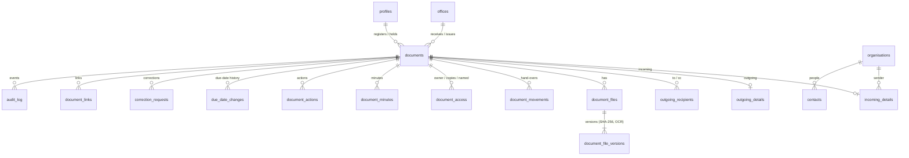

# Database Schema: Review Guide

This guide explains the Supabase database schema for the NEC Document Tracking System and how it meets the requirements specification.

- **SQL file:** [`migrations/20261004000000_initial_schema.sql`](migrations/20261004000000_initial_schema.sql)
- **Status:** Draft for review. It has not been applied to any Supabase project.

---

## 1. Design in one paragraph

Every document, incoming or outgoing, is one row in `documents`. Fields specific to incoming or outgoing documents sit in `incoming_details` or `outgoing_details`. Scans are stored in a private Supabase Storage bucket, and every version is kept with a SHA-256 fingerprint. Routing, hand-overs, minutes, actions and due-date changes are each kept in their own tables, and rows are only ever added to them. **Nothing can be deleted.** A registered record locks when it is saved. After that it changes only through an approved correction request, and every change is written to a permanent, tamper-evident audit log. The browser can only **read** data, and what it can read is filtered by role and classification. All writes go through server-side functions, which are the next step.

---

## 2. Tables

### Configuration (Administrators maintain these; rows are deactivated, never deleted)

| Table | Holds |
|---|---|
| `offices` | CH (Chairperson), SG (Secretary General). The code is used in reference numbers. |
| `departments` | Departments, optionally tied to an office |
| `categories` | Operations, Finance, Legal, Partners/Donors, Political parties, Government, HR |
| `document_types` | Letter, request, invitation, report, complaint, legal notice, invoice, memo, other |
| `priority_rules` | Urgent 24 h, High 3 d, Normal 7 d, Low 14 d. Stored in a table because NEC has not confirmed them yet. |
| `status_transitions` | The allowed status changes. Any other change is rejected. |
| `organisations`, `contacts` | Contacts list for senders and recipients, so names are spelled consistently |
| `system_settings` | Mode B switch, office network ranges, password policy, alert switches |

### Users

| Table | Holds |
|---|---|
| `auth.users` (Supabase) | Login email and password, two-factor login |
| `profiles` | Name, **role**, office, department, suspended/active, forced password change, password age, failed logins, lock, remote-access permission |

### Documents

| Table | Holds |
|---|---|
| `documents` | Reference number, office, direction, subject, type, category, priority, classification, pages, physical location, **status, current holder, how long they have held it, due date**, closing note, void flag |
| `incoming_details` | Sender organisation, name and title; who delivered it (name, phone, ID seen); delivery method; sender's reference; whether a response is required and its due date; acknowledgement slip |
| `outgoing_details` | Drafted by, signatory, Final/locked time, dispatch method/date/messenger, delivery date and proof, feedback required, due date, follow-up officer, feedback received |
| `outgoing_recipients` | Multiple *To* and *Cc* recipients |
| `document_links` | Related letters, *in reply to*, *feedback for*, and internal memo pairs |
| `reference_counters` | The running number for each office, direction and year (internal) |

### Files

| Table | Holds |
|---|---|
| `document_files` | A logical file on a document: main scan, attachment, draft, signed copy, proof of delivery, acknowledgement slip |
| `document_file_versions` | Each upload, never overwritten: storage path, **SHA-256**, size, pages, DPI, colour, PDF/A, **OCR text** (full-text indexed), reason for a re-scan |
| `file_integrity_checks` | Results of the scheduled fingerprint checks |

### Workflow

| Table | Holds |
|---|---|
| `document_access` | Primary owner, copies, and named recipients of Confidential documents |
| `document_movements` | Every hand-over (from, to, when, reason; system routing or physical move) and its **acknowledgement** |
| `document_minutes` | Chairperson / SG instructions, shown first to the action officer |
| `document_actions` | Comments, actions taken, feedback, task completed |
| `due_date_changes` | Old and new due date, with a mandatory reason |

### Integrity and operations

| Table | Holds |
|---|---|
| `correction_requests` | Field, old value, new value, reason, requester, approver, decision. The requester cannot approve their own request. |
| `audit_log` | Every event, permanent and **hash-chained**: each row's fingerprint includes the previous row's, so editing or removing a row breaks the chain |
| `notifications` | In-system alerts (and email/SMS when Mode B allows) |
| `backup_runs`, `backup_restore_tests` | Backup log and the quarterly restore tests |
| `disposal_requests` | Records disposal, which requires **both** Administrators to approve |

### Views

| View | Shows |
|---|---|
| `v_document_tracker` | Where each document is, who holds it, how long they have held it, whether it is overdue and by how many days |
| `v_unacknowledged_movements` | Hand-overs not acknowledged within 24 hours |
| `v_feedback_overdue` | Outgoing documents whose feedback is past due |
| `v_current_file_versions` | The latest version of each file |

---

## 3. How each requirement is enforced

These rules are enforced **inside the database**, so the application cannot bypass them.

| Requirement | Where |
|---|---|
| Reference number `NEC/CH/IN/2026/00123`: automatic, never reused, restarts each year | `next_reference_number()` and the insert trigger on `documents` |
| Receipt date and time use **server time**, not the PC clock | Insert trigger overwrites `registered_at` / `received_at` |
| Incoming record **cannot be saved without its scan** | Check at commit (`documents_check_complete`) |
| Due date set automatically from priority | Insert trigger, using `priority_rules` |
| Due date changed only with a reason | Update trigger plus `due_date_changes` |
| Register fields **lock on save**; corrections only through an approved request | `documents_before_update`, `tg_details_lock` |
| Outgoing **Draft is editable**; **Final locks** it | Same triggers (the lock is skipped while status = draft) |
| No deletion by anyone, including Administrators | `prevent_delete` / `prevent_truncate` on every table, and no delete permission |
| "Delete" replaced by **Void** with a reason | `is_voided` + `void_reason`; a voided record can no longer change |
| Scans are read-only; a re-scan is a new version | `document_file_versions` cannot be updated; Storage has no update/delete policy |
| Hand-over history cannot be removed | Movements are append-only (only the acknowledgement can be filled in) |
| Closing requires a closing note | Check constraint `closing_requires_note` |
| Outgoing cannot be closed without the signed scan; Delivered needs proof | Status rules in `documents_before_update` |
| Only valid status changes | `status_transitions` table |
| **Max two** System Administrators | `limit_administrators` trigger |
| Lock after **5 failed logins** | `hook_password_verification_attempt` (Supabase Auth hook) |
| Forced password change at first login; **90-day** expiry; suspended or locked users see nothing | `is_session_permitted()`, used by every access rule |
| Confidential visible only to Executive Viewers, Administrators and named recipients | `can_view_document()` |
| Mode B: remote logins need **two-factor**; Confidential can be **office-only** | `is_session_permitted()` / `can_view_document()` (office network ranges are in `system_settings`) |
| Everything audited, with old and new values; the audit trail is permanent and read-only | `tg_audit_row` on all tables, plus the hash chain on `audit_log` |
| Views, downloads, prints and report exports are audited | `log_client_event()`, which accepts only those event types |
| Full-text search inside scans | `document_file_versions.ocr_tsv` (GIN index); fuzzy search on subjects and sender names |
| South Sudan time (CAT, UTC+2) | Database timezone `Africa/Juba` |

### Who can see what (read access)

| Role | Documents | Audit trail | Correction requests |
|---|---|---|---|
| System Administrator | All, including Confidential | Yes | All |
| Executive Viewer | All, including Confidential | No | Own |
| Registry Officer | All Open and Restricted, plus Confidential routed to them | No | Own |
| Action Officer | Only documents routed, copied or named to them | No | Own |
| Auditor | All Open and Restricted (see decision 1) | Yes | All |

What each role may **do** (register, route, approve and so on) belongs to the server functions in the next step.

---

## 4. Testing done

I applied the migration to a local PostgreSQL 16 database, using stand-ins for Supabase's `auth` and `storage` schemas, and ran these checks. All passed:

- Reference numbers came out as `NEC/CH/IN/2026/00001`, `…00002` and `NEC/SG/IN/2026/00001`. A rejected save did not use up a number.
- An incoming record without a scan was rejected.
- A High priority document got a due date of received time + 3 days.
- Editing a saved subject, sender, reference number or due date was blocked.
- A correction approved by an Administrator went through, and the audit entry shows the old value, the new value and the request ID.
- Deleting or truncating documents or audit entries was blocked. Editing an audit entry or a file version was blocked.
- Jumping a status (registered → closed) was blocked. Changing a voided document was blocked.
- An outgoing draft could be edited, and was locked once Final. Marking it Delivered without proof was blocked. Closing it without the signed copy was blocked.
- The feedback-overdue view picked up the late item.
- Read access: the Registry Officer, Action Officer, Chairperson and Auditor each saw exactly the documents in the table above. The Action Officer saw no audit rows. Full-text search found a phrase inside OCR text and respected classification.
- A third administrator was rejected.
- 5 bad passwords locked the account, and the lock then rejected a correct password.
- The audit hash chain verified intact across 101 entries.

---

## 5. Decisions and assumptions for your review

1. **Auditors and Confidential documents.** The specification says Confidential documents are visible *only* to Executive Viewers, Administrators and named recipients, so Auditors cannot currently see them. Should Auditors see Confidential documents?
2. **Restricted vs Open.** The specification does not say how Restricted differs from Open, so they currently behave the same. A suggested rule: Restricted documents are hidden from Registry Officers of the *other* office.
3. **Internal memos between the two offices.** These are currently registered twice: as outgoing from the sending office (`NEC/CH/OUT/…`) and as incoming at the receiving office (`NEC/SG/IN/…`), with the two records linked. The alternative is a separate memo series (e.g. `NEC/CH/MEMO/2026/00001`).
4. **Locked accounts** stay locked until an Administrator unlocks them. The alternative is unlocking automatically after, for example, 30 minutes.
5. **One role per user.** If someone needs two roles (for example an Administrator who is also an Action Officer), this needs a user-roles table instead.
6. **Shared or separate registers** (one of NEC's open decisions). The schema supports both. Numbering is per office, and search can cover both offices or be filtered to one.
7. **Only Registry Officers upload files.** Should Action Officers be able to attach files to their actions or feedback?
8. **Offline requirement.** Mode A needs **self-hosted Supabase** (Docker) on the office server. The supabase.com cloud service needs internet and cannot meet Mode A.

---

## 6. Next step (after your go-ahead)

The next step is the server-side functions that perform every write and check who may do it:

- `register_incoming`, `register_outgoing`
- `route_document`, `forward`, `return`, `acknowledge`
- `add_minute`, `record_action`, `change_due_date`, `close_document`, `void_document`
- `request_correction`, `approve_correction`
- `mark_final`, `record_dispatch`, `record_delivery`, `record_feedback`
- Admin user management (create, suspend, reset, unlock)
- Scheduled jobs: due-soon and overdue alerts, daily summary, fingerprint checks

Supabase settings to configure at the same time:

- Minimum password length 10
- Session inactivity timeout 15 minutes
- TOTP two-factor login enabled
- The password-verification hook registered
- Public sign-ups disabled, so only Administrators can create accounts
